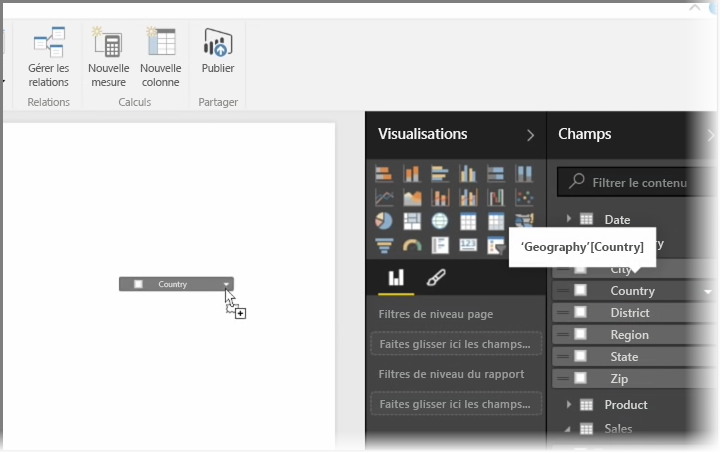
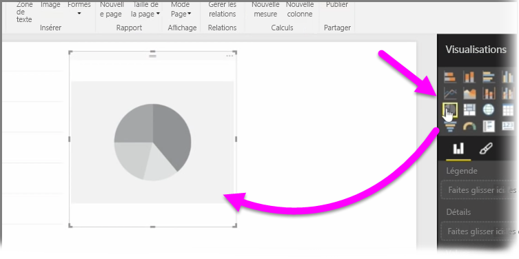
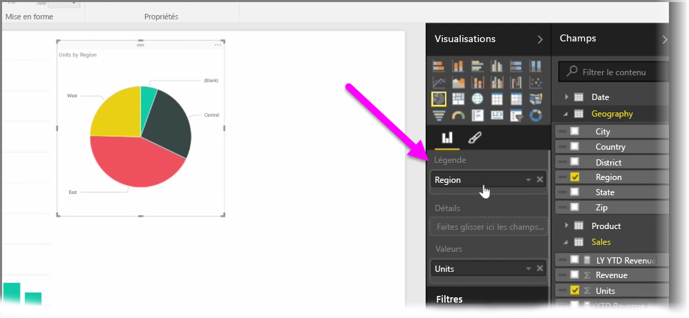
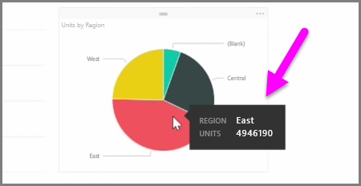
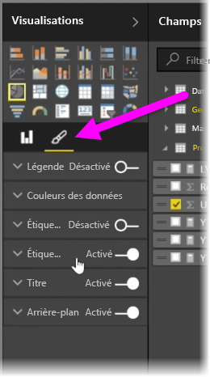

Dans cet article, vous allez apprendre à créer des graphiques à barres, des graphiques à secteurs et des treemaps et à les personnaliser en fonction de vos rapports.

Il existe deux façons de créer une visualisation dans Power BI Desktop :

* Vous pouvez faire glisser des noms de champ depuis le volet **Champs** et les déposer sur le canevas de rapport. Par défaut, la visualisation apparaît sous la forme d’une table de données.
  
  
* Vous pouvez également cliquer sur le type de visualisation à créer dans le volet **Visualisations**. Avec cette méthode, l’élément visuel par défaut est un espace réservé vide qui ressemble au type de visuel que vous avez sélectionné.
  
  

Une fois que vous avez créé votre graphique ou carte, vous pouvez commencer à faire glisser des champs de données sur la partie inférieure du volet **Visualisations** pour créer et organiser votre élément visuel. Les champs disponibles changent en fonction du type de visualisation que vous sélectionnez. Quand vous faites glisser et déposez les champs de données, la visualisation se met automatiquement à jour pour refléter les modifications.

Vous pouvez redimensionner la visualisation en la sélectionnant et en faisant glisser les poignées vers l’intérieur ou l’extérieur. Vous pouvez également déplacer votre visualisation n’importe où sur la zone de dessin en cliquant dessus, puis en la faisant glisser. Si vous souhaitez effectuer une conversion entre différents types de visualisations, sélectionnez l’élément visuel que vous souhaitez modifier et sélectionnez simplement un autre élément visuel parmi les icônes du volet **Visualisations**. Power BI essaie de convertir les champs sélectionnés dans le nouveau type d’élément visuel de façon aussi proche que possible.

Quand vous pointez sur une partie de vos visualisations, vous obtenez une info-bulle qui contient des détails sur ce segment, tels que des étiquettes et la valeur totale.

Sélectionnez l’icône **pinceau** dans le volet **Visualisations** pour modifier certains aspects de votre élément visuel, tels que l’alignement de l’arrière-plan, le texte du titre et les couleurs de données.

Les options disponibles pour ces modifications dépendent de l’élément visuel sélectionné.

