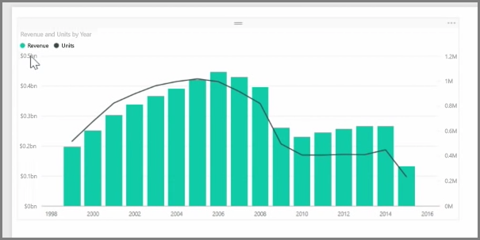
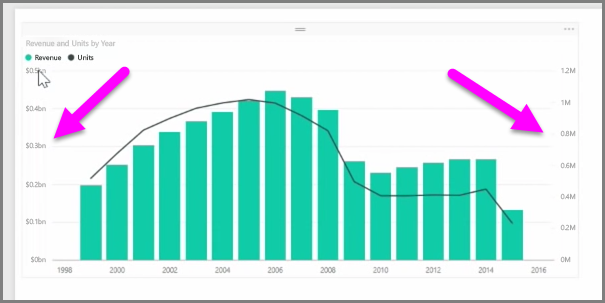
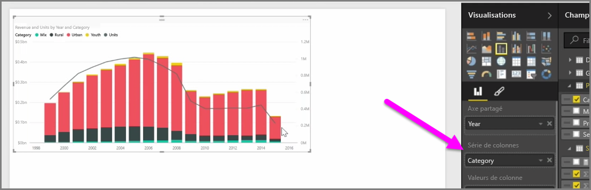

Quand vous souhaitez visualiser deux mesures qui ont des échelles très différentes, telles que le chiffre d’affaires et les unités, un **graphique combiné** qui affiche une ligne et une barre avec différentes échelles d’axe est très utile. Par défaut, Power BI prend en charge différents types de graphiques combinés, dont les graphiques courants **Ligne** et **Histogramme empilé**.

Quand vous créez un graphique combiné, apparaissent un champ pour **Axe partagé** (axe X), puis des valeurs pour vos deux champs, en l’occurrence sous la forme d’une colonne et d’une ligne. Les deux légendes de l’axe Y apparaissent de chaque côté de la visualisation.

Vous pouvez également fractionner chaque colonne par catégorie, en faisant glisser une catégorie dans le champ Série de colonnes dans le volet Visualisations. Quand vous procédez ainsi, chaque barre est colorée proportionnellement en fonction des valeurs dans chaque catégorie.

Les graphiques combinés sont un moyen efficace pour afficher dans une même visualisation plusieurs mesures qui ont des échelles très différentes.

