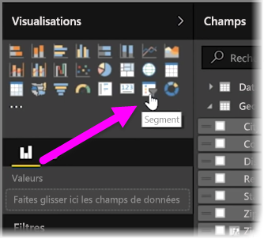
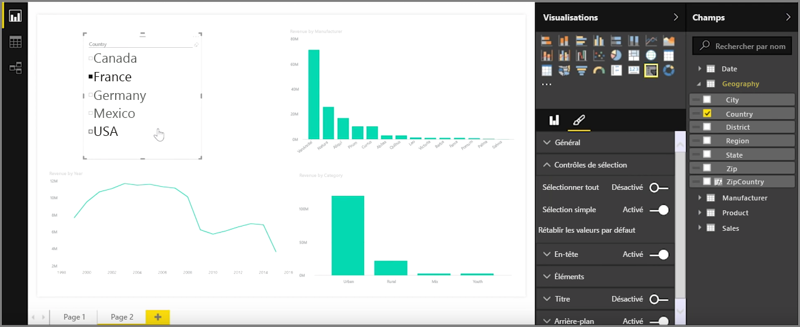

Les segments sont un des types de visualisations les plus puissants, notamment dans le cadre d’un rapport de disponibilité. Un **segment** est un filtre visuel sur le canevas dans **Power BI Desktop**. Il permet à une personne qui consulte un rapport de segmenter les données en fonction d’une valeur particulière, comme une année ou un emplacement géographique.

Pour ajouter un segment à votre rapport, sélectionnez **Segment** à partir du volet **Visualisations**.

Faites glisser le champ en fonction duquel vous souhaitez segmenter les données, puis déposez-le au-dessus de l’espace réservé de segment. La visualisation se transforme en une liste d’éléments dotés de cases à cocher. Ces éléments sont vos filtres : quand vous cochez la case à côté d’un segment, toutes les autres visualisations sur la même page de rapport sont filtrées, ou *segmentées*, en fonction de votre sélection.

Vous disposez de plusieurs options pour mettre en forme votre segment. Vous pouvez le définir pour qu’il accepte plusieurs entrées à la fois, ou basculer sur le mode **Sélection simple** pour qu’il utilise une entrée à la fois. Vous pouvez également ajouter une option **Sélectionner tout** à vos éléments de segment, ce qui est utile quand vous avez une liste particulièrement longue. Par défaut, un segment est orienté verticalement et s’apparente à une liste de choix ; si vous l’orientez horizontalement, il prend la forme d’une barre de sélection.

