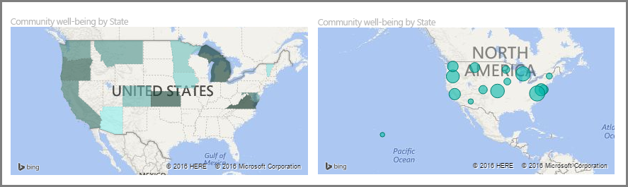
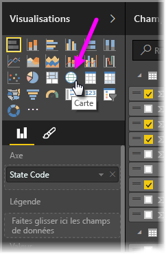
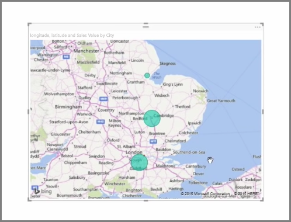
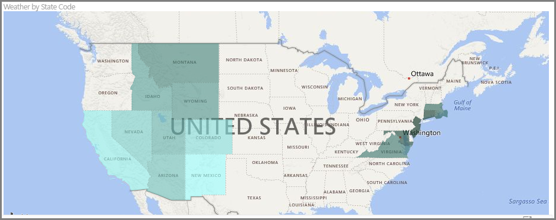
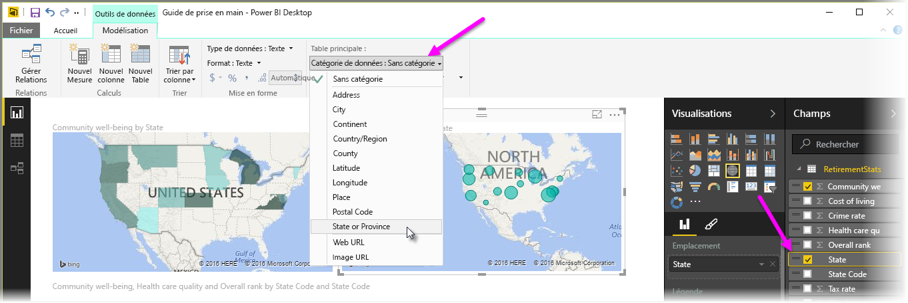

Power BI a deux types de visualisations de carte : une carte à bulles qui place une bulle sur un point géographique et une carte de forme qui affiche le contour de la zone à visualiser.

> [!NOTE]
> Lorsque vous utilisez des pays ou régions, utilisez l’abréviation à trois lettres pour vous assurer que le géocodage fonctionne correctement dans des visualisations de carte. N’utilisez *pas* d’abréviations à deux lettres, car il se peut que certains pays ou régions ne soient pas correctement reconnus.
> Si vous disposez d’abréviations à deux lettres, consultez [ce billet de blog externe](https://blog.ailon.org/how-to-display-2-letter-country-data-on-a-power-bi-map-85fc738497d6#.yudauacxp) pour savoir comment associer vos abréviations de pays/région à deux lettres à vos abréviations de pays/région à trois lettres.
> 
> 

## Créer des cartes à bulles
Pour créer une carte à bulles, sélectionnez l’option **Carte** dans le volet **Visualisations**. Vous devez ajouter une valeur au compartiment *Emplacement* dans les options **Visualisations** pour utiliser un élément visuel de carte.

Power BI accepte un large éventail de types de valeurs d’emplacement, allant de détails plus généraux, comme un nom de ville ou un code d’aéroport, à des données de latitude et longitude très spécifiques. Ajoutez un champ au compartiment **Taille** pour modifier la taille de la bulle en conséquence pour chaque emplacement de la carte.

## Créer des cartes de forme
Pour créer une carte de forme, sélectionnez l’option **Carte choroplèthe** dans le volet Visualisations. Comme dans le cas des cartes à bulles, vous devez ajouter un type de valeur au compartiment Emplacement pour utiliser cet élément visuel. Ajoutez un champ au compartiment Taille pour modifier l’intensité de la couleur de remplissage en conséquence.

Une icône d’avertissement dans le coin supérieur gauche de votre élément visuel indique que la carte a besoin de davantage de données d’emplacement pour tracer les valeurs avec précision. Il s’agit d’un problème courant en particulier quand les données dans le champ d’emplacement sont ambiguës, comme dans le cas de l’utilisation d’un nom de zone comme *Washington* qui peut indiquer un état ou un district. Pour résoudre ce problème, vous pouvez renommer votre colonne de façon plus précise, par exemple *État*. Vous pouvez également réinitialiser manuellement la catégorie de données en sélectionnant **Catégorie des données** sous l’onglet Modélisation. Ensuite, vous pouvez affecter une catégorie à vos données, comme « État » ou « Ville ».

