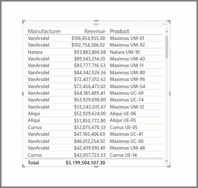
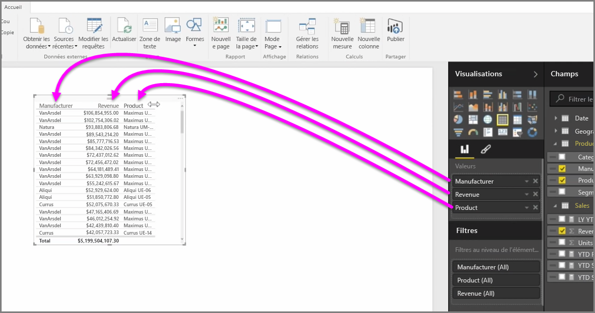
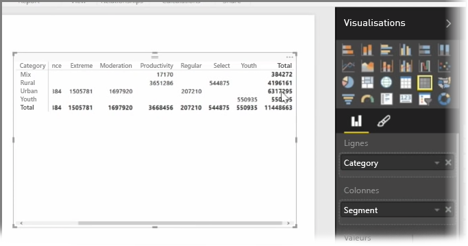

Outre une multitude de graphiques, Power BI Desktop prend en charge davantage de visualisations tabulaires. De fait, quand vous saisissez un champ de catégorie ou de texte et que vous le faites glisser sur le canevas de rapport, vous obtenez une table de résultats par défaut. Vous pouvez faire défiler la table vers le bas et vers le haut, qui est initialement triée par ordre alphabétique.

Si une table contient des informations numériques, comme des chiffres d’affaires, une somme totale apparaît en bas. Vous pouvez effectuer un tri manuel en fonction d’une colonne spécifique ; pour ce faire, cliquez sur l’en-tête de cette colonne afin de la classer par ordre croissant ou décroissant. Si une colonne n’est pas assez large pour afficher tout son contenu, cliquez sur son en-tête et faites-le glisser latéralement pour l’étendre.

L’ordre des champs dans le compartiment *Valeurs* du volet **Visualisations** détermine l’ordre dans lequel ils apparaissent dans votre table.

Une **matrice** est similaire à une table, mais elle comporte différents en-têtes de catégorie sur les lignes et colonnes. Comme dans le cas des tables, les totaux des informations numériques apparaissent automatiquement, en l’occurrence en bas et à droite de la matrice.

De nombreuses options sont disponibles pour définir l’aspect des matrices, telles que le dimensionnement automatique des colonnes, l’activation/désactivation de la ligne ou colonne des totaux ou la définition des couleurs. Lorsque vous créez une matrice, vérifiez que les données de catégorie (c’est-à-dire non numériques) sont situées à gauche de la matrice et les fichiers numériques à droite pour vous assurer que la barre de défilement horizontale s’affiche et que le défilement fonctionne correctement.

