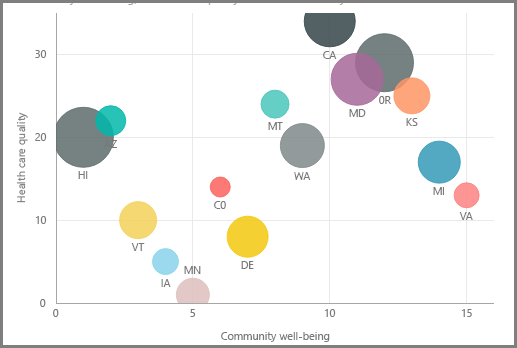
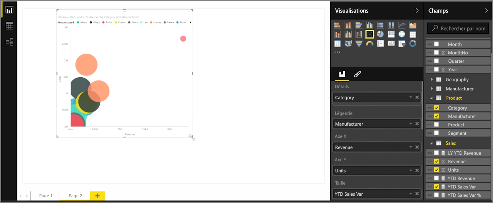
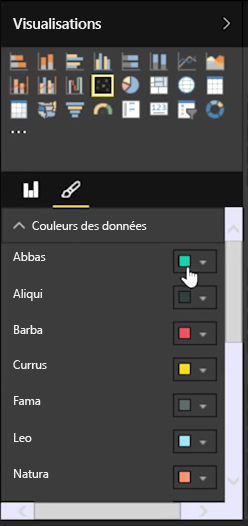
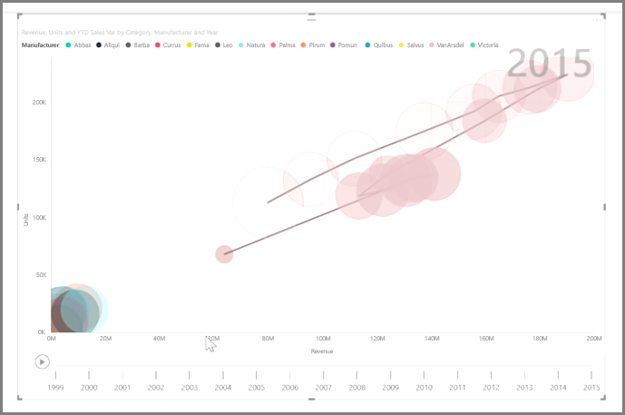

Si vous souhaitez comparer deux mesures différentes, telles que le chiffre d’affaires et les ventes unitaires, une visualisation courante à utiliser est un nuage de points.

Pour créer un graphique vide, sélectionnez **Nuage de points** dans le volet **Visualisations**. Faites glisser les deux champs que vous souhaitez comparer depuis le volet **Champs** jusqu’aux compartiments d’options *Axe X* et *Axe Y*. À ce stade, votre nuage de points est probablement juste une petite bulle au centre de l’élément visuel ; vous devez ajouter une mesure au compartiment *Détails* pour indiquer comment vous souhaitez segmenter vos données. Par exemple, pour comparer des ventes d’articles et des recettes, vous pouvez fractionner les données par catégorie, fabricant ou mois de vente.

Quand vous ajoutez un champ au compartiment *Légende*, vos bulles se voient affecter un code de couleur en fonction de la valeur du champ. Vous pouvez également ajouter un champ au compartiment *Taille* pour modifier la taille des bulles en fonction de cette valeur.

En outre, les nuages de points offrent de nombreuses options de mise en forme des éléments visuels, telles que l’activation d’une limite pour chaque bulle de couleur et l’activation/désactivation des différentes étiquettes. Vous pouvez également modifier les couleurs de données pour d’autres types de graphique.

Vous pouvez créer une animation qui reflète l’évolution de votre graphique à bulles au fil du temps en ajoutant un champ temporel au compartiment *Axe de lecture*. Cliquez sur une bulle pendant une animation pour afficher une trace de son évolution.

>[!NOTE]
>Si vous voyez une seule bulle dans votre nuage de points, cela signifie que Power BI agrège vos données, ce qui correspond au comportement par défaut. Ajoutez une catégorie au compartiment *Détails*, dans le volet **Visualisations**, pour obtenir plus de bulles.
> 
> 

