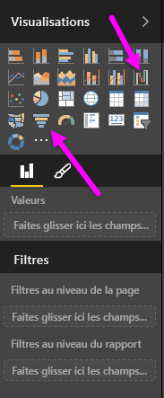
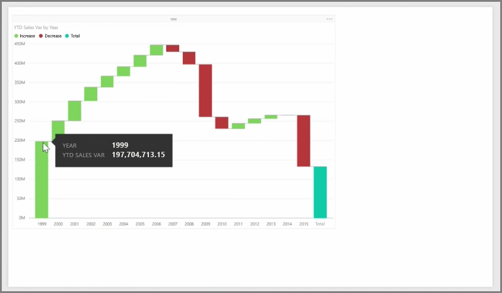
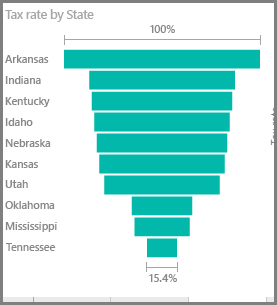

Les graphiques en cascade et en entonnoir sont deux des visualisations standard les plus intéressantes (et peut-être peu courantes) incluses dans Power BI. Pour créer un graphique vide d’un de ces types, sélectionnez l’icône correspondante dans le volet **Visualisations**.

Les **graphiques en cascade** servent généralement à afficher les modifications que subit une valeur particulière au fil du temps.

Les cascades ont uniquement deux options de compartiments : *Catégorie* et *Axe Y*. Faites glisser un champ temporel comme *Année* vers le compartiment *Catégorie*, et la valeur dont vous souhaitez effectuer le suivi vers le compartiment *Axe Y*. Par défaut, les périodes de temps où la valeur a augmenté apparaissent en vert, tandis que celles où elle a diminué apparaissent en rouge.

Les **Graphiques en entonnoir** servent généralement à afficher les modifications qui jalonnent un processus particulier, comme un pipeline des ventes ou les efforts de conservation de clientèle avec un site web.

Les deux graphiques **en cascade** et **en entonnoir** peuvent être segmentés et visuellement personnalisés.

