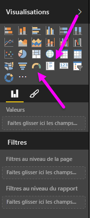
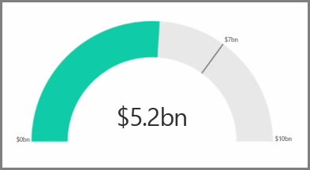
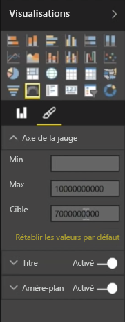
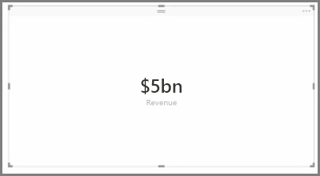
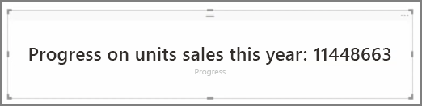

En règle générale, les visualisations sont utilisées pour comparer deux ou plusieurs valeurs différentes. Cependant, parfois au moment de la création de rapports, vous pouvez souhaiter suivre l’évolution d’une métrique ou d’un indicateur de performance clé (KPI) spécifique dans le temps. La façon de procéder dans Power BI Desktop consiste à utiliser un élément visuel de **jauge** ou de **carte à numéro unique**. Pour créer un graphique vide d’un de ces types, sélectionnez l’icône correspondante dans le volet **Visualisations**.

Les jauges sont particulièrement utiles quand vous créez des tableaux de bord et que vous souhaitez afficher la progression vers une cible particulière. Pour créer une jauge, sélectionnez son icône dans le volet **Visualisations** et faites glisser le champ dont vous souhaitez effectuer le suivi dans le compartiment *Valeur*.

Par défaut, les jauges sont réglées sur 50 % ou sur le double de la *Valeur*, paramétrage que vous pouvez modifier de deux façons. Pour définir les valeurs de façon dynamique, faites glisser les champs vers les compartiments *Minimum*, *Maximum* et *Valeur cible*. Vous pouvez également utiliser les options de mise en forme des éléments visuels pour personnaliser manuellement la plage de votre jauge.

Les visualisations de carte affichent simplement une représentation numérique d’un champ. Par défaut, les éléments visuels de carte utilisent des unités d’affichage pour que le nombre apparaisse sous forme abrégée ; par exemple, « €5Mrd » peut être affiché au lieu de « €5 000 000 000 ». Utilisez les options de mise en forme des éléments visuels pour modifier l’unité utilisée ou pour la désactiver complètement.

Une application intéressante des cartes consiste à leur faire afficher une mesure personnalisée que vous avez concaténée avec du texte. Si nous reprenons l’exemple précédent, avec une mesure personnalisée, votre carte peut inclure des fonctions DAX avancées et afficher quelque chose comme « Chiffre d’affaires total de cette année : €5Mrd » ou « Progression des ventes unitaires cette année : » suivi du nombre représentant la progression.

