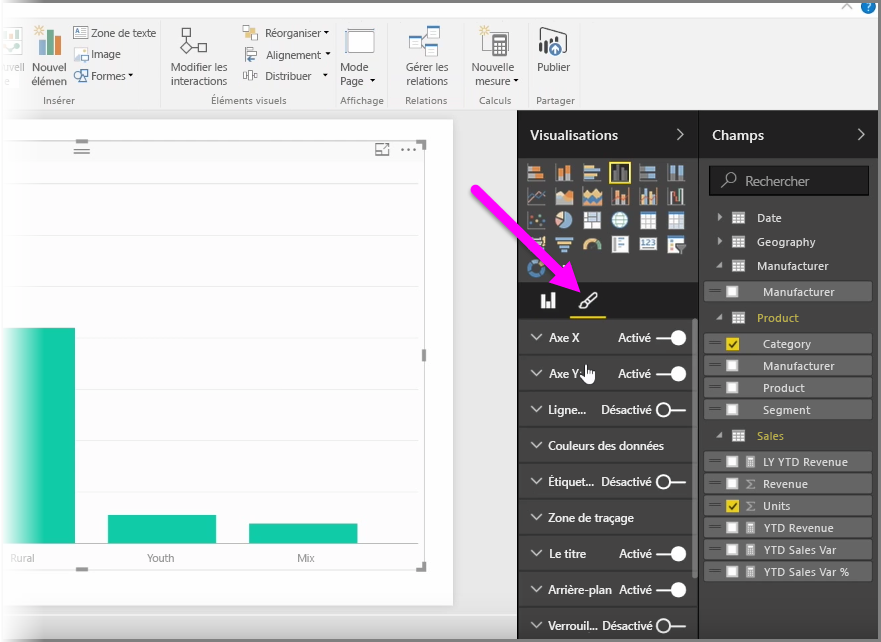
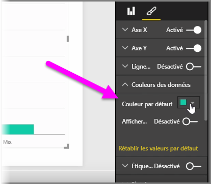
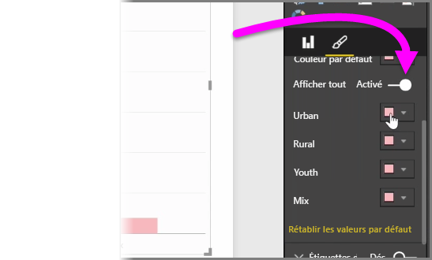
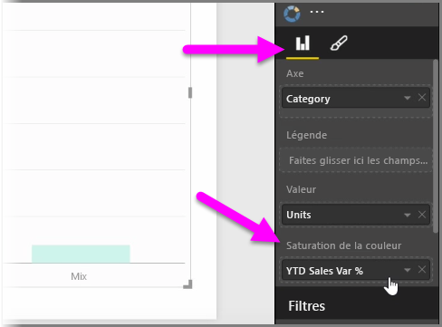
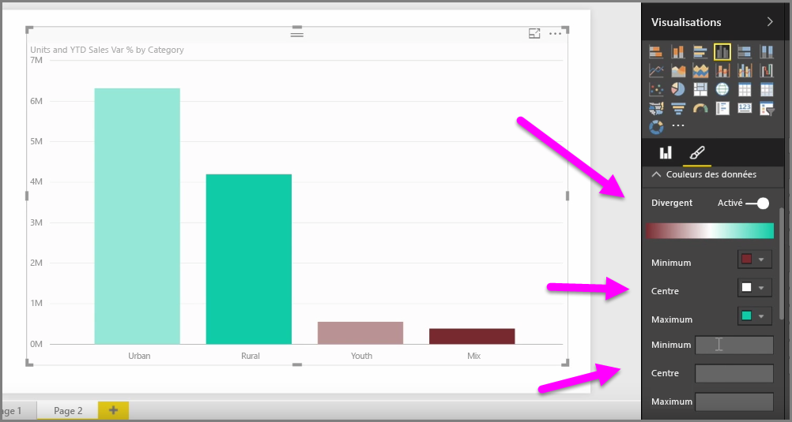
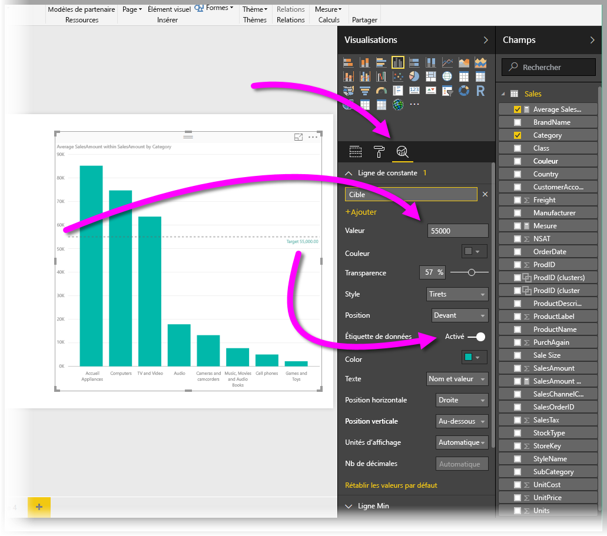
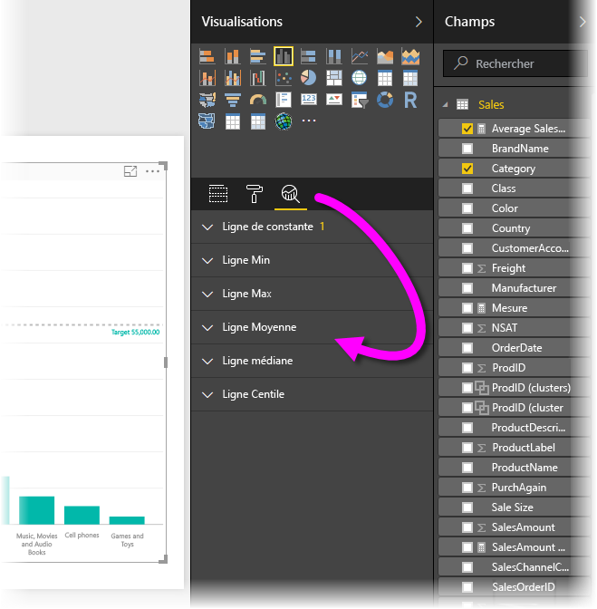

Les situations justifiant une modification des couleurs utilisées dans les graphiques ou les éléments visuels peuvent être fréquentes. Grâce à Power BI, vous pouvez contrôler l’affichage des couleurs. Pour commencer, sélectionnez un élément visuel puis, dans le volet **Visualisations**, cliquez sur l’icône **pinceau**.

De nombreuses options sont disponibles pour modifier les couleurs ou la mise en forme de l’élément visuel. Vous pouvez modifier la couleur de toutes les barres d’un élément visuel en sélectionnant le sélecteur de couleur en regard de **Couleur par défaut**, puis en sélectionnant la couleur de votre choix.

Vous pouvez également modifier la couleur de chaque barre (ou autre élément, selon le type d’élément visuel sélectionné) en positionnant le curseur **Afficher tout** sur Activé. Dans ce cas, un sélecteur de couleur s’affiche pour chaque élément.

Vous pouvez également modifier la couleur selon une valeur ou une mesure. Pour effectuer cette opération, faites glisser un champ dans le compartiment **Saturation de la couleur** dans le volet Visualisations (cette option est disponible dans la **zone des champs**, mais pas dans la section **pinceau**).

En outre, vous pouvez modifier l’échelle et les couleurs qui sont utilisées pendant le remplissage des couleurs d’éléments de données. Vous pouvez également sélectionner une échelle divergente en positionnant le curseur Divergent sur Activé, et associer ainsi à la couleur une échelle reposant sur trois couleurs. Vous pouvez aussi définir les valeurs *Minimum*, *Centre* et *Maximum* affichées sur votre graphique.

En outre, vous pouvez utiliser ces valeurs pour créer des règles, par exemple, pour affecter une certaine couleur aux valeurs supérieures à zéro et une autre couleur aux autres valeurs.

Un autre procédé très pratique pour utiliser les couleurs consiste à définir une *ligne de constante*, parfois appelée *ligne de référence*. Vous pouvez définir la valeur de la ligne de constante, définir sa couleur et même y inclure une étiquette. Pour créer une ligne de constante (et d’autres lignes intéressantes), sélectionnez le **volet Analytique** (qui ressemble à une loupe), puis développez la section **Ligne de référence**.

Il existe plusieurs autres lignes que vous pouvez créer pour un visuel, également disponibles dans le **volet Analytique**, telles que les lignes Min, Max, Moyenne, Médiane et Centile.

Enfin, vous pouvez créer une bordure autour d’une visualisation individuelle et, comme pour les autres contrôles, vous pouvez aussi spécifier la couleur de cette bordure.

