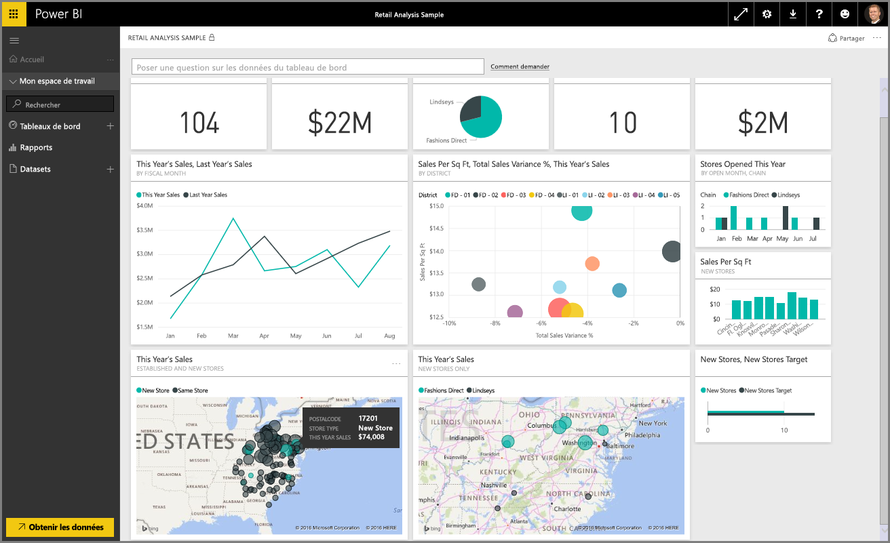
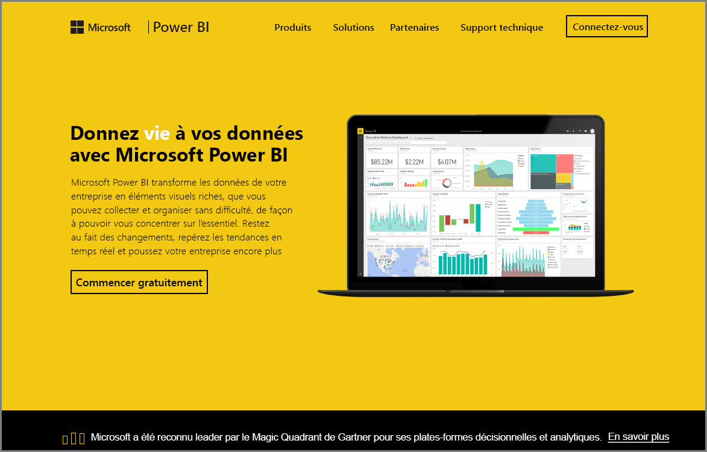

Bienvenue dans la section **Exploration des données** du cours **Formation guidée** pour Power BI. Maintenant que vous êtes familiarisé avec Power BI Desktop et que vous savez comment obtenir et visualiser des données, vous êtes prêt à explorer des données dans le service Power BI.

Cette section vous permet d’apprendre toutes sortes de choses. Les remarquables fonctionnalités de partage et d’interactivité de Power BI sont véritablement mises en valeur ici. Préparez-vous à aborder une section attrayante et intéressante.

## Présentation du service Power BI
*Découvrez ce que le service Power BI peut faire pour votre organisation*

Le service Power BI est une extension naturelle de **Power BI Desktop**, et ses fonctionnalités incluent le chargement de rapports, la création de tableaux de bord et l’interrogation de vos données en langage naturel. Vous pouvez utiliser le service pour définir des heures d’actualisation des données, partager des données avec votre organisation et créer des Service Packs personnalisés.

Dans les rubriques suivantes, nous allons explorer le service Power BI et vous montrer comment il peut transformer vos données Business Intelligence en une analyse des données et un environnement collaboratif motivant vos décisions.

