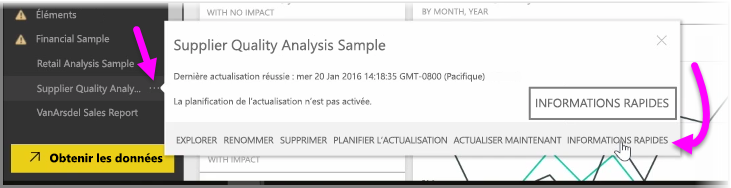
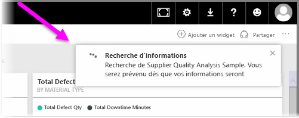
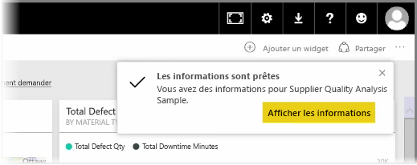
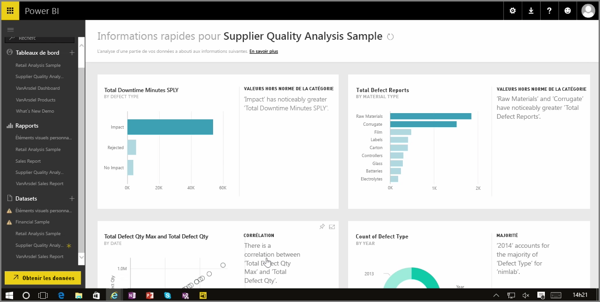

Quand vous travaillez avec un tableau de bord, un rapport ou un jeu de données dans le service Power BI, vous pouvez demander à Power BI de rechercher des informations rapides sur les données. Dans Power BI, dans la section **Jeux de données** du volet gauche, sélectionnez les *points de suspension* (...) en regard du jeu de données qui vous intéresse. Un menu d’options s’affiche et vous verrez, à l’extrême droite, une option nommée **Informations rapides**.

Quand vous sélectionnez Informations rapides, Power BI effectue un apprentissage automatique et effectue des recherches dans les données, en les analysant pour trouver des informations rapides. Une notification s’affiche en haut à droite dans le service, indiquant que Power BI travaille à la recherche d’informations.

Après environ 15 secondes, la notification change pour vous informer que Power BI a trouvé des informations.

Quand vous sélectionnez le bouton **Afficher les informations** sur la notification, une page d’éléments visuels qui indiquent les informations trouvées par Power BI s’affiche, similaire à ce que vous voyez dans l’image suivante. Vous pouvez faire défiler sur la page le groupe d’informations affiché, pour les afficher et les examiner.

Comme tout autre élément visuel, vous pouvez interagir avec les éléments visuels de la page Informations rapides. Vous pouvez également épingler n’importe lequel d’entre eux à un tableau de bord, ou filtrer davantage un ou plusieurs d’entre eux (ou autant que vous le souhaitez) pour rechercher des informations supplémentaires que votre curiosité vous permettra de découvrir.

Avec l’option **Informations rapides**, vous pouvez laisser Power BI faire le travail pour détecter les valeurs hors norme et les tendances dans vos données, puis utiliser ces conclusions dans vos tableaux de bord, ou les affiner et les filtrer un peu plus pour obtenir les informations les plus importantes pour vous.

