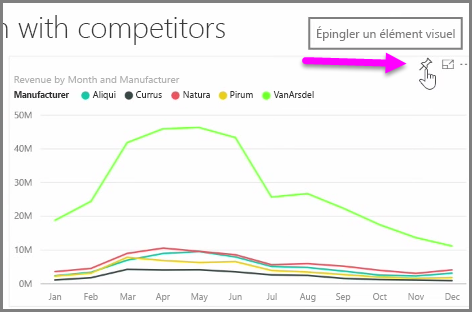
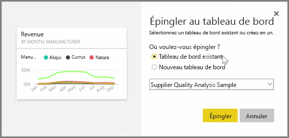
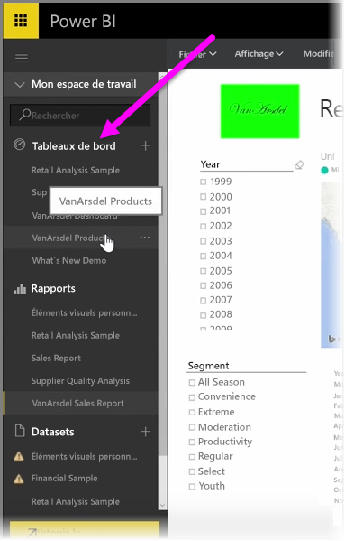
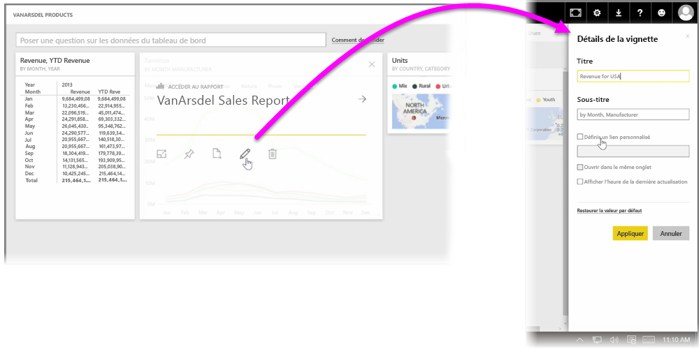

Les **tableaux de bord** dans Power BI sont des collections sur une page de visualisations qui sont créées dans le service Power BI. Vous créez des tableaux de bord en **épinglant** des visualisations à partir de rapports que vous avez créés et publiés à l’aide de Power BI Desktop, ou des visualisations que vous avez créées dans le service Power BI lui-même. L’**épinglage** d’un élément visuel à un tableau de bord ressemble beaucoup à l’épinglage d’une photo à un tableau en liège sur un mur : il y colle l’élément visuel, dans une zone particulière, pour que d’autres puissent le voir. Pour épingler un élément visuel, ouvrez son rapport sur le service Power BI. Placez votre curseur sur l’élément visuel que vous voulez épingler, puis sélectionnez l’icône **Épingle**.

Une boîte de dialogue s’affiche, dans laquelle vous sélectionnez un tableau de bord de destination pour l’élément visuel dans le menu déroulant. Vous pouvez aussi créer un nouveau tableau de bord. Vous obtenez également un aperçu de ce à quoi ressemblera l’élément visuel épinglé dans le tableau de bord. Vous pouvez épingler des visualisations provenant de plusieurs rapports et pages à un tableau de bord unique, ce qui vous permet de combiner différents jeux de données et différentes sources en une seule page d’aperçus.

Sur les **tableaux de bord**, vous pouvez ajouter toutes sortes de visualisations, notamment des graphiques, des cartes, des images et des formes, en les « épinglant ». Une fois qu’un élément visuel est épinglé à un tableau de bord, il est appelé **vignette**.

Vos tableaux de bord, notamment les nouveaux, apparaissent dans la section Tableaux de bord sur le côté gauche du service Power BI. Sélectionnez un tableau de bord dans la liste pour l’afficher.

Vous pouvez modifier la disposition des éléments visuels dans un tableau de bord comme vous le souhaitez. Pour redimensionner une vignette, faites glisser ses poignées vers l’intérieur ou vers l’extérieur. Pour déplacer une vignette, cliquez simplement dessus et faites-la glisser vers un autre emplacement sur le tableau de bord. Placez votre curseur sur une vignette, puis cliquez sur l’icône **Crayon** pour ouvrir les **Détails de la vignette**, où vous pouvez modifier le **Titre** ou le **Sous-titre**.

Cliquez sur une vignette de tableau de bord pour afficher le rapport dont elle provient. Cela vous permet d’afficher rapidement les données sous-jacentes sous un élément visuel. Vous pouvez également modifier ce lien à l’aide du champ **Définir un lien personnalisé** dans **Détails de la vignette**.

Vous pouvez épingler des vignettes d’un tableau de bord vers un autre, par exemple si vous avez une collection de tableaux de bord et que vous voulez créer un tableau de synthèse. Le processus est identique : placez votre curseur sur la vignette, puis sélectionnez l’**icône Épingle**. Les tableaux de bord sont faciles à créer et à modifier. Et vous pouvez les personnaliser pour que votre tableau de bord sur une page affiche exactement ce qu’il doit.

