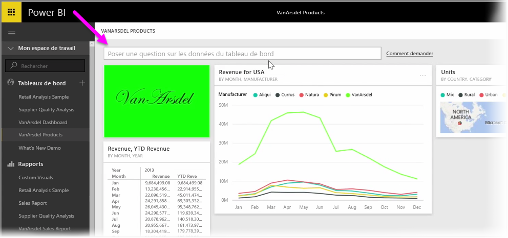
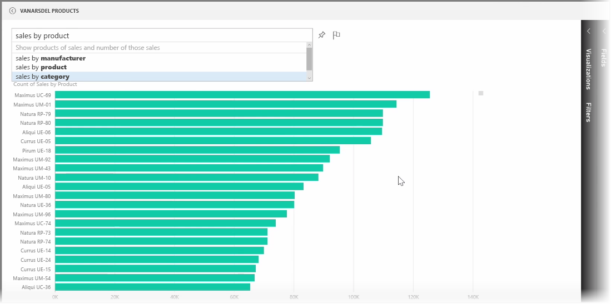
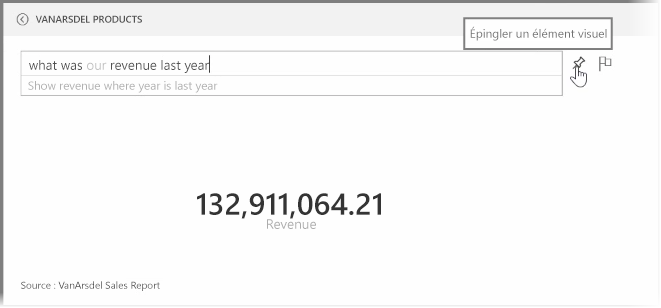
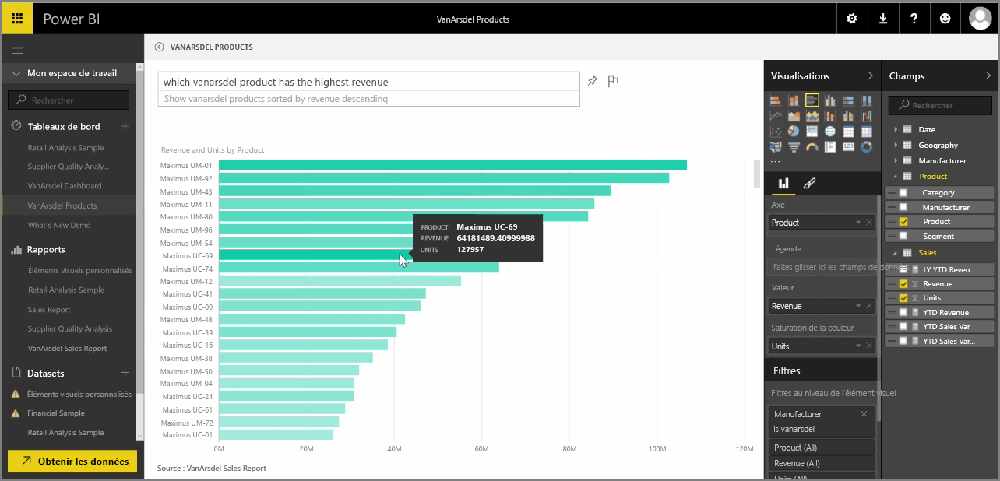

Power BI est livré avec un moteur de reconnaissance du langage puissant qui vous permet de poser des questions sur vos données à l’aide d’expressions et de questions de qualité conversation. Par conséquent, tout en créant des rapports et des visualisations Power BI, vous pouvez créer des diagrammes et des graphiques en posant simplement des questions simples.

Pour poser une question sur vos données, ouvrez un tableau de bord dans Power BI. Vous verrez alors en haut de l’écran une zone d’entrée dans laquelle vous pouvez poser des questions sur les données affichées. Cette fonctionnalité est parfois appelée *Questions et réponses*, ou plus souvent, elle est uniquement appelée **Q&R**.

Quand vous cliquez dans la zone, Power BI affiche des invites avec certaines suggestions de termes en fonction de vos données, comme « Chiffre d’affaires annuel à ce jour ». Vous pouvez cliquer sur une suggestion de terme pour voir le résultat, souvent affiché sous la forme d’un simple tableau ou d’une simple carte. Quand vous sélectionnez l’une des expressions suggérées, Power BI crée automatiquement un élément visuel en fonction de votre sélection, en temps réel.

Vous pouvez également poser des questions en langage naturel, comme « Quel était notre chiffre d’affaires l’année dernière ? » ou « Quel produit avait les plus fortes ventes en mars 2014 ? ». Power BI affiche son interprétation de votre question et choisit le meilleur type d’élément visuel pour représenter la réponse. Et tout comme n’importe quel autre élément visuel dans Power BI, vous pouvez l’**épingler** au tableau de bord de votre choix en sélectionnant l’icône **Épingle**.

À tout moment au cours du processus, vous pouvez modifier l’élément visuel créé par votre question ou expression en langage naturel. Utilisez simplement les volets **Visualisations** et **Champs** sur le côté droit de l’écran. Comme pour tout autre élément visuel dans Power BI, vous pouvez modifier la disposition, ajuster des filtres et modifier les entrées de champ.

Pour enregistrer la visualisation dans un tableau de bord une fois que vous avez créé l’élément visuel parfait, sélectionnez simplement l’icône **Épingle** en regard de la zone d’entrée des questions.

