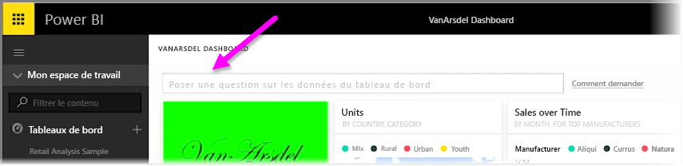
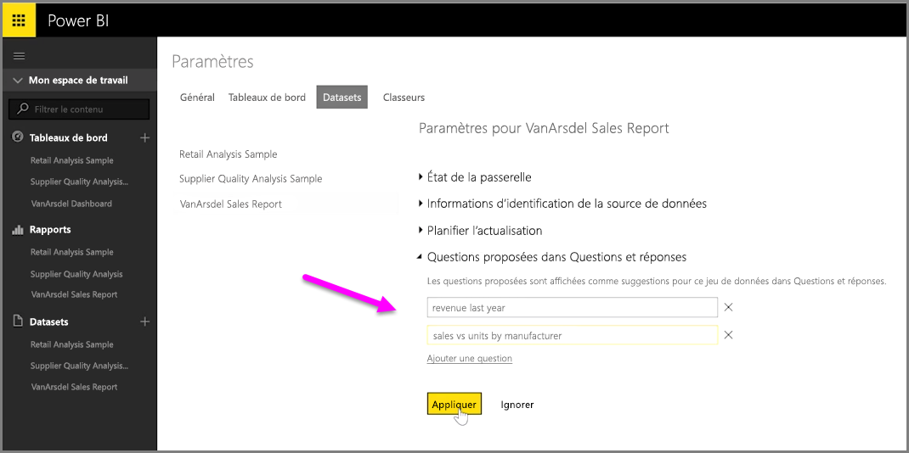

Avec Power BI, vous pouvez ajouter vos propres suggestions de questions pour les autres utilisateurs qui utilisent la zone de requête en langage naturel d’un tableau de bord, souvent appelée zone **Q&R**. Ces suggestions de questions sont ce que les utilisateurs voient quand ils cliquent sur la zone d’entrée en haut d’un tableau de bord.

Pour ajouter vos propres questions, sélectionnez ... (points de suspension) à côté du nom du tableau de bord que vous voulez utiliser, puis sélectionnez **Paramètres** dans le menu.

 Cette opération ouvre la page **Paramètres** du tableau de bord, ainsi que des jeux de données et classeurs sous-jacents. Vous pouvez totalement désactiver la zone de recherche de Q&R à partir de la section **Tableaux de bord** de la page **Paramètres**, mais nous voulons ajouter des questions. Nous allons donc sélectionner la section **Jeux de données**.

Dans la section **Jeux de données**, tous les jeux de données associés au tableau de bord sont affichés. Sélectionnez le jeu de données associé à votre tableau de bord dans la liste, sélectionnez **Questions Q&R proposées**, puis sélectionnez le lien **Ajouter une question**. Entrez votre question ou invite dans la zone d’entrée, puis sélectionnez **Appliquer**.

Maintenant, chaque fois qu’un utilisateur clique sur la zone de recherche du tableau de bord sélectionné, il voit vos suggestions d’entrées en haut de la liste d’invites. S’il sélectionne cette question, il est directement redirigé vers la réponse de Q&R. C’est un moyen très utile de faire réfléchir les utilisateurs du tableau de bord sur le type de données disponibles et sur la meilleure façon dont ils peuvent les utiliser.

