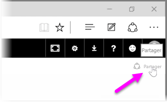
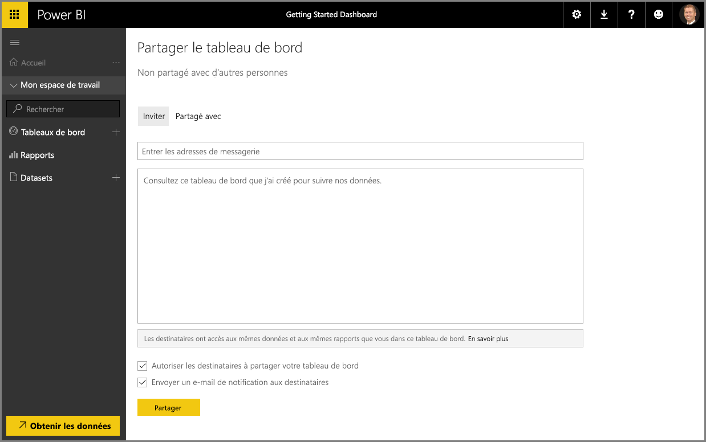

Nous avons déjà vu comment Power BI vous aide à rechercher des données, à les collecter dans un modèle de données et à générer des rapports et des visualisations sur l’utilisation de ces données. Nous avons également vu comment vous pouvez publier ces rapports dans le service Power BI et créer des tableaux de bord qui vous permettent d’analyser vos informations au fil du temps. Toutes ces fonctionnalités sont encore plus puissantes quand vous partagez vos informations avec d’autres personnes de votre organisation. Heureusement, il est facile de partager vos tableaux de bord.

Pour partager un tableau de bord, ouvrez-le dans le service Power BI, puis sélectionnez le lien **Partager** en haut à droite.

La page **Partager le tableau de bord**, dans laquelle vous pouvez sélectionner la section **Inviter**, s’affiche. Vous pouvez ensuite renseigner la zone d’entrée **Adresse de messagerie** avec des personnes auxquelles vous voulez accorder l’accès à votre tableau de bord. À mesure que vous tapez les adresses e-mail, Power BI les vérifie par rapport aux comptes de votre domaine et du domaine Office 365, et effectue une saisie semi-automatique quand cela est possible. Vous pouvez également copier et coller des adresses e-mail dans cette zone, ou utiliser une liste de distribution, un groupe de sécurité ou un groupe Office 365 pour contacter plusieurs personnes à la fois.

Si vous avez coché la case (en bas de l’écran) pour *envoyer un e-mail de notification aux destinataires*, vos destinataires recevront un e-mail les informant que vous avez partagé un tableau de bord avec eux, et incluant un lien avec le tableau de bord. Vous pouvez ajouter une note à l’e-mail qu’ils recevront ou envoyer la note que Power BI a automatiquement créée (elle se trouve dans la zone immédiatement sous l’emplacement où vous entrez leurs adresses e-mail).

>[!NOTE]
>Les destinataires sans compte Power BI existant sont guidés dans le processus de connexion avant de visualiser votre tableau de bord.
> 
> 

Toutes les personnes avec qui vous partagez un tableau de bord peuvent le voir et interagir avec lui, exactement comme vous le faites. Toutefois, elles ont un accès *en lecture seule* aux rapports sous-jacents, et n’ont *aucun accès* aux jeux de données sous-jacents.

Vous pouvez également sélectionner l’onglet **Partagé avec** de la page Partager le tableau de bord pour voir les personnes avec lesquelles vous avez précédemment partagé ce tableau de bord.

