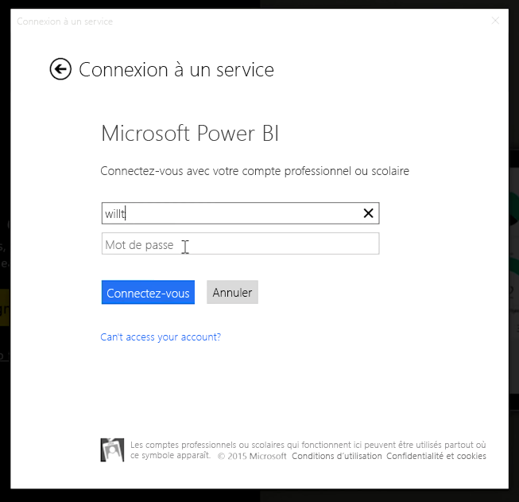
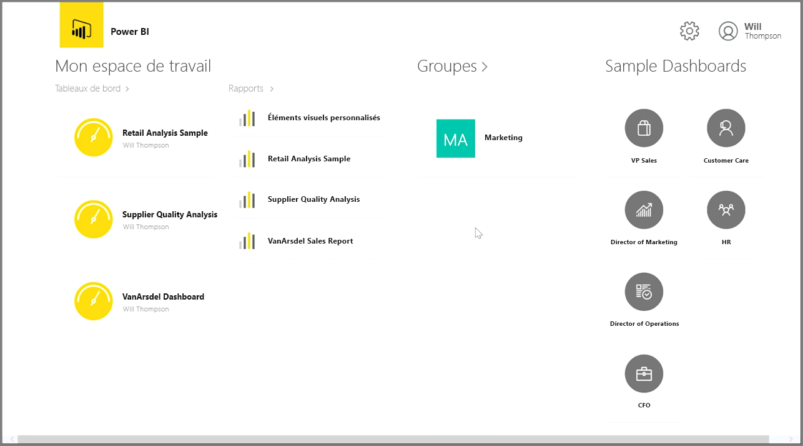
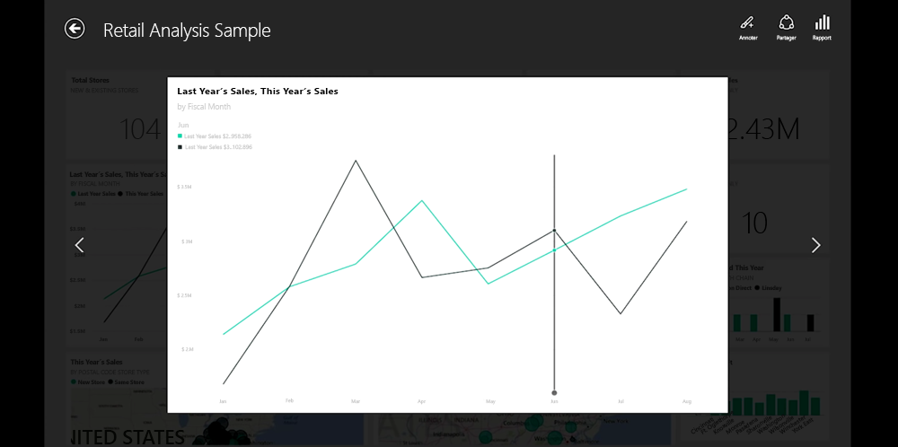
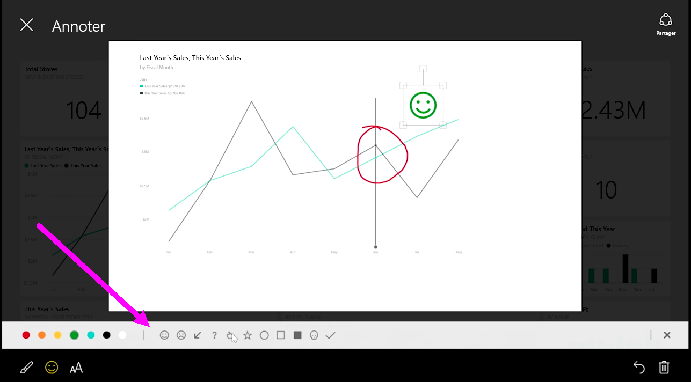

Si vous voulez effectuer le suivi de vos données pendant que vous êtes en déplacement, vous pouvez utiliser une des applications mobiles de Power BI pour les appareils iOS, Android et Windows.

Quand vous utilisez l’application Power BI, commencez par vous connecter à votre compte à l’aide des informations de votre compte de service Power BI. Sur un appareil mobile Windows (dans le cas présent, une tablette), la connexion se présente comme suit.

Le premier écran qui s’affiche présente tout le contenu auquel vous avez accès, notamment des rapports, des tableaux de bord et des groupes. Il contient également des exemples que vous pouvez utiliser comme source d’inspiration, ou juste pour voir les fonctionnalités de Power BI. L’application est conçue pour être tactile : appuyez sur un tableau de bord ou un rapport pour l’afficher en plein écran, et faites-les défiler à l’aide de votre doigt.

Vous pouvez ouvrir n’importe lequel des tableaux de bord en appuyant dessus. Dans un tableau de bord, vous pouvez appuyer sur une vignette de tableau de bord pour vous concentrer sur ce dernier dans une vue agrandie.

Vous pouvez également annoter toutes les informations trouvées en cliquant sur le bouton **Annoter** en haut à droite. Cela vous permet de dessiner sur un titre ayant le focus pour mettre en évidence des zones d’intérêt particulières. Les outils d’annotation se trouvent en bas de l’écran.

Partagez votre vignette annotée en appuyant sur le lien **Partager** en haut à droite.

Cliquez sur le lien **Rapport** en haut à droite pour afficher le rapport sous-jacent d’une vignette. Cette opération affiche exactement les mêmes visualisations que celles que vous verriez dans un navigateur web ou dans Power BI Desktop, et offrent également la possibilité d’interagir avec le rapport en appuyant sur les barres, en descendant dans la hiérarchie ou en utilisant des segments.

