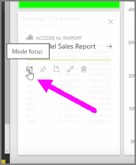
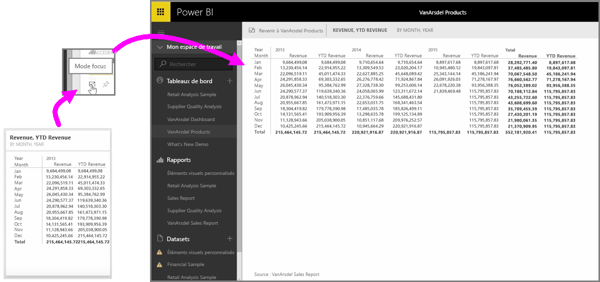

Quand vous examinez des tableaux de bord ou des rapports Power BI dans le service, il peut parfois être utile de se concentrer sur un graphique ou une visualisation individuels. Vous pouvez le faire de deux manières différentes.

Quand vous êtes sur un tableau de bord, placez votre curseur sur une vignette pour afficher plusieurs options d’icône en haut à droite. Quand vous sélectionnez les points de suspensions (...), une collection d’icônes représentant des actions que vous pouvez effectuer sur la vignette s’affiche.

L’icône la plus à gauche s’appelle **Mode focus**. Sélectionnez cette icône pour développer la vignette de façon à ce qu’elle englobe la totalité de l’espace du tableau de bord.

Le **mode focus** vous permet de voir beaucoup plus de détails sur vos éléments visuels et légendes. Par exemple, quand vous redimensionnez une vignette dans Power BI, certaines des colonnes peuvent ne pas être affichées en raison de l’espace disponible dans la vignette.

En **mode focus**, vous pouvez voir toutes les données. Vous pouvez également épingler l’élément visuel directement du mode focus à un autre tableau de bord en sélectionnant l’icône **Épingle**. Pour quitter le **mode focus**, sélectionnez l’icône **Retour à...** en haut à gauche du **mode focus**.

Le processus est le même quand vous affichez un rapport. Placez votre curseur sur un élément visuel pour afficher les trois icônes en haut à droite, puis sélectionnez l’icône **Mode focus**. Cette option développe votre visualisation pour englober la totalité du canevas de rapport. Dans ce mode, l’élément visuel est toujours interactif, même si vous perdez temporairement tout effet de filtrage croisé entre les visualisations.

Placez votre curseur sur une vignette ou un rapport développé, puis sélectionnez l’icône du signe supérieur **Retour à** en haut à gauche pour revenir à la vue précédente.

