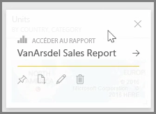
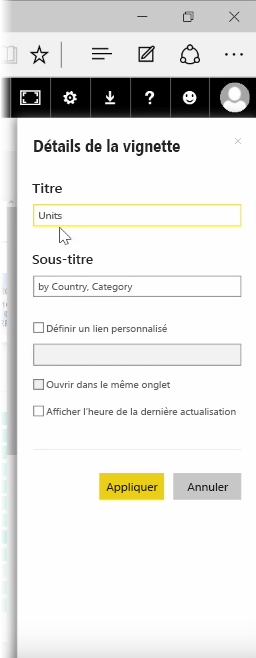
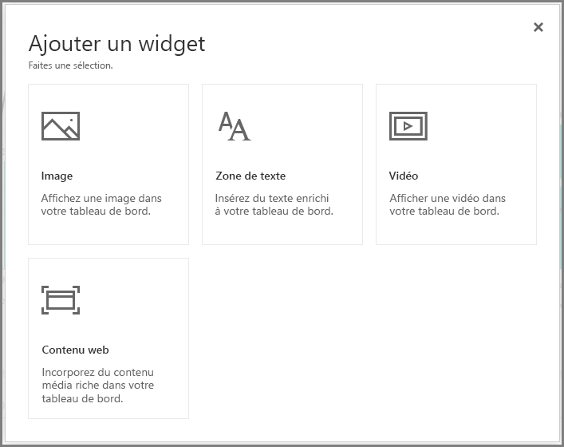
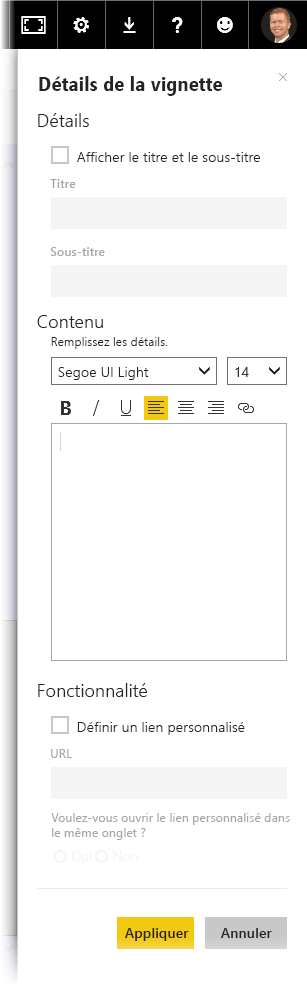

Une fois que vous avez créé un tableau de bord, vous pouvez modifier ses **vignettes* dans le service Power BI pour apporter des modifications à la mise en forme.

Pour apporter des modifications sur une vignette, placez votre curseur sur la vignette, puis sélectionnez les points de suspension (...) pour afficher une collection d’icônes qui vous permettent d’apporter des modifications à la vignette.

Sélectionnez l’icône **Stylet** pour ouvrir le volet **Détails de la vignette**. À partir de là, vous pouvez modifier le **Titre** de la vignette, son **Sous-titre**, inclure l’heure et la date de sa dernière actualisation, ainsi que d’autres détails tels que la création d’un lien personnalisé.

Par défaut, quand vous cliquez sur une vignette du tableau de bord, vous accédez au rapport dont elle provient. Pour modifier ce comportement, utilisez le champ **Définir un lien personnalisé** du volet **Détails de la vignette**. Une utilisation courante de cette fonctionnalité consiste à rediriger les utilisateurs vers la page d’accueil de l’organisation quand ils cliquent sur une image de logo.

## Ajouter des widgets au tableau de bord
Vous pouvez également ajouter des widgets à votre tableau de bord. Un **widget** est une vignette spéciale du tableau de bord qui, au lieu de contenir une visualisation, contient d’autres éléments tels qu’une image, une vidéo en ligne, une zone de texte ou du contenu web enrichi.

Quand vous sélectionnez le lien Ajouter un widget en haut à droite dans un tableau de bord, la boîte de dialogue **Ajouter un widget** s’affiche.

Quand vous ajoutez une zone de texte, par exemple, un volet **Détails de la vignette** s’affiche sur la droite, où vous pouvez modifier des informations semblables à ce qui est disponible quand vous modifiez les détails de n’importe quelle vignette. Mais avec des widgets, il existe également une section permettant de définir ou de modifier le contenu du widget, comme un éditeur de texte enrichi pour une zone de texte.

Avec les widgets et la possibilité de modifier les détails des vignettes, vous pouvez personnaliser votre tableau de bord et lui donner exactement l’aspect souhaité.

