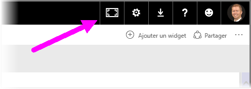
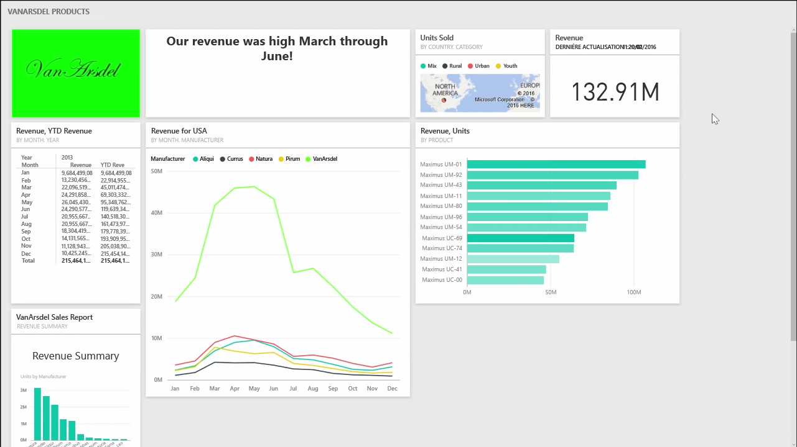
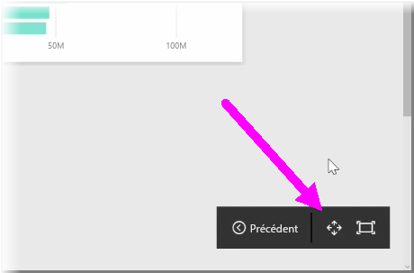
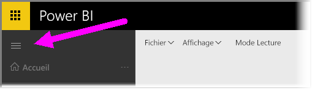

Vous constaterez peut-être que, parfois, quand vous créez vos tableaux de bord, vous avez plus de contenu que ce qui peut tenir sur le canevas. Il existe certaines solutions qui vous permettent de gérer la façon dont l’espace de votre tableau de bord s’affiche, afin de pouvoir obtenir une vue complète du contenu de votre tableau de bord.

La méthode la plus simple d’afficher l’ensemble de votre tableau de bord dans un seul écran consiste à sélectionner le bouton **Mode plein écran** en haut à droite dans le tableau de bord.

La sélection du bouton **Mode plein écran** met votre navigateur en mode plein écran, ce qui supprime tous les éléments de cadre autour du tableau de bord, et augmente ainsi la quantité d’espace visible.

En **mode plein écran**, vous pouvez sélectionner l’option **Ajuster à l’écran** pour réduire toutes vos vignettes afin qu’elles tiennent sur un seul écran, sans nécessiter des barres de défilement. Ce mode, communément appelé *mode TV*, est utile pour effectuer des présentations avec des tableaux de bord ou pour afficher un tableau de bord sur des écrans de surveillance.

Une autre façon de gérer l’espace du tableau de bord consiste à réduire le volet de navigation sur le côté gauche de la page, en sélectionnant l’icône représentant un hamburger. Pour développer le volet de navigation, cliquez à nouveau sur l’icône.

Vous pouvez vérifier que la barre de navigation d’un tableau de bord sera toujours réduite en ajoutant la chaîne suivante à la fin de l’URL :

> ?collapseNavigation=true
> 
> 

Les utilisateurs qui suivent ce lien ouvriront le tableau de bord avec une barre de navigation réduite.

