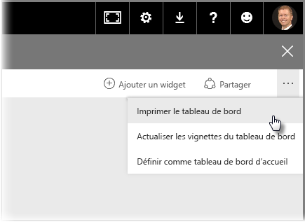
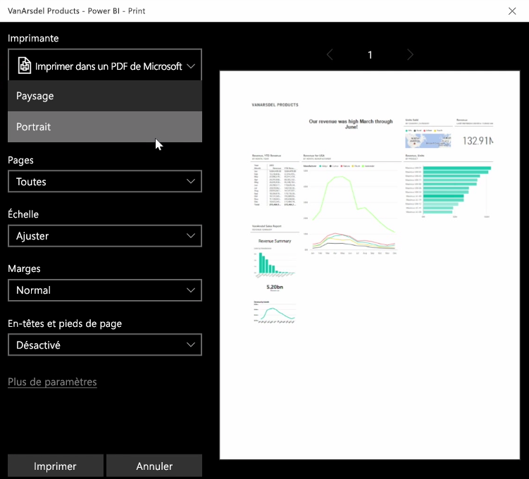
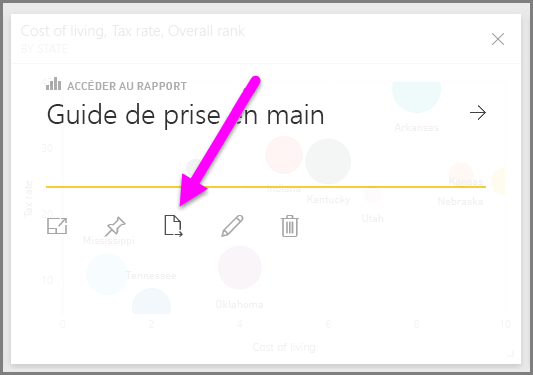
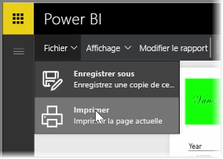

Vous pouvez parfois souhaiter apporter un rapport ou un tableau de bord imprimé à une réunion, ou par conséquent, pour pouvoir ainsi le partager avec d’autres personnes. Avec Power BI, vous pouvez effectuer des impressions de vos visuels de différentes manières.

Dans le service Power BI, sélectionnez ... (points de suspension) en haut à droite du service, puis sélectionnez **Imprimer le tableau de bord**.

Une boîte de dialogue **Imprimer** s’affiche. Elle vous permet de sélectionner l’imprimante à laquelle vous voulez envoyer le tableau de bord ainsi que des options d’impression standard, telles que l’orientation *Portrait* ou *Paysage*.

## Exporter des données à partir d’un élément visuel
Vous pouvez également exporter les données d’un élément visuel vers le service Power BI. Sélectionnez simplement les points de suspension (...) sur un élément visuel, puis sélectionnez le bouton **Exporter des données** (le bouton du milieu). Cette opération crée et télécharge un fichier .CSV sur votre ordinateur local, et un message s’affiche dans votre navigateur (comme pour tout autre téléchargement initié par le navigateur), vous informant que le téléchargement est terminé.

Vous pouvez également imprimer ou exporter directement à partir d’un rapport. Quand vous affichez un rapport dans le service Power BI, sélectionnez **Fichier > Imprimer** pour ouvrir la boîte de dialogue d’impression.

Et tout comme avec un tableau de bord, vous pouvez également exporter des données d’un élément visuel dans un rapport, en sélectionnant le bouton Exporter sur un élément visuel.

