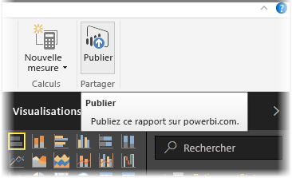
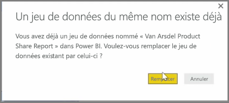
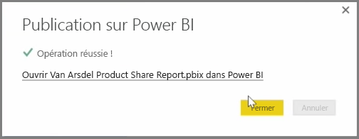

Vous pouvez mettre à jour des rapports et des jeux de données que vous avez déjà publiés à partir de Power BI Desktop dans le service Power BI. Pour ce faire, sélectionnez **Publier** sous l’onglet **Accueil** du ruban.

Quand vous publiez un rapport qui existe déjà dans le service Power BI, vous êtes invité à confirmer que vous voulez remplacer le jeu de données et les rapports précédents par la version modifiée que vous venez de choisir de mettre à jour.

Quand vous sélectionnez **Remplacer**, les jeux de données et les rapports présents dans le service Power BI sont remplacés par les jeux de données et les rapports de la dernière version Power BI Desktop du fichier.

Et comme pour n’importe quel autre événement **Publier** de Power BI Desktop, une boîte de dialogue vous indiquant que l’événement de publication a réussi s’affiche, et vous obtenez un lien vers le rapport dans le service Power BI.

Il s’agit d’un moyen d’actualiser manuellement vos données. Vous pouvez également mettre à jour automatiquement des jeux de données et des rapports. Ce processus est traité dans une autre rubrique de la formation.

