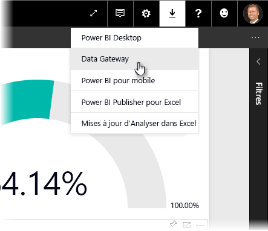
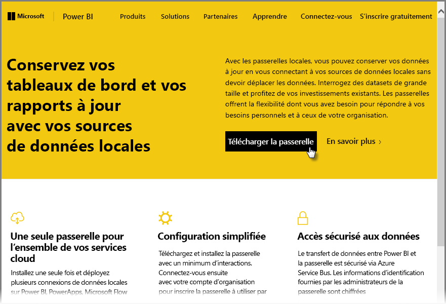
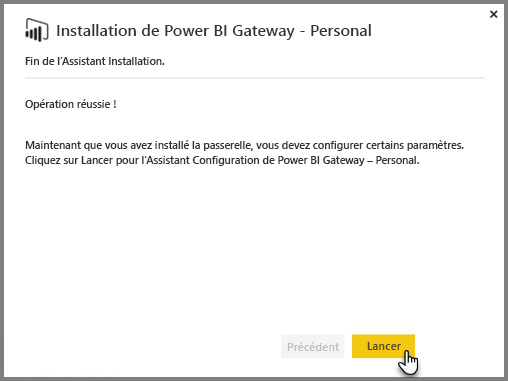
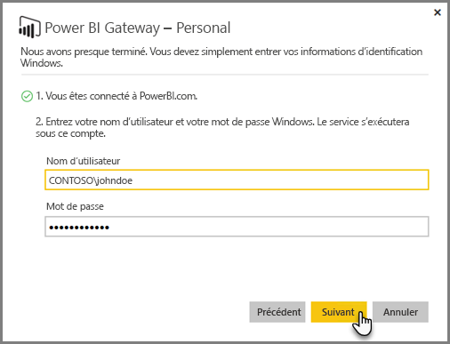
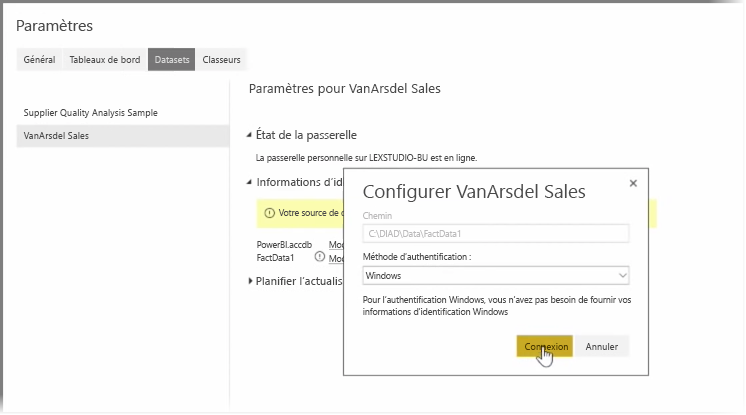
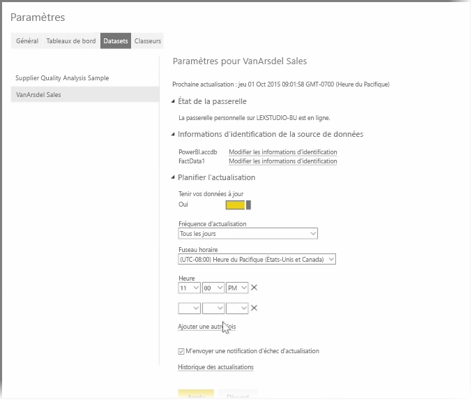

Dans les rubriques précédentes, nous avons examiné comment vous pouvez utiliser Power BI pour vous connecter à des sources de données et comment actualiser manuellement vos jeux de données sur le service Power BI. Toutefois, vous n’allez pas vouloir actualiser manuellement les éléments chaque fois que vos données changent. Vous pouvez donc utiliser Power BI pour configurer une actualisation planifiée qui se connectera à vos sources de données et les publiera automatiquement dans le service Power BI. Vous pourrez ainsi vous connecter au service avec toutes les sources de données locales, notamment des fichiers Excel, des bases de données Access, des bases de données SQL, etc.

Le système qui vous permet de connecter vos sources de données locales au service Power BI est appelé **Passerelle de données**. Il s’agit d’une petite application qui s’exécute sur votre ordinateur et utilise une planification préétablie pour se connecter à vos données, collecter toutes les mises à jour, puis les transmettre au Service Power BI. **Personal Gateway** est une version de la **passerelle de données** qui peut être utilisée sans aucune configuration de la part de l’administrateur.

>[!NOTE]
>L’ordinateur qui exécute Power BI Personal Gateway *doit* être allumé et être connecté à Internet pour que **Personal Gateway** fonctionne correctement.
> 

Pour configurer **Personal Gateway**, commencez par vous connecter au service Power BI. Sélectionnez l’icône **Télécharger** en haut à droite de l’écran, puis **Passerelles de données** dans le menu.

Vous êtes alors dirigé vers une page web dans laquelle vous pouvez sélectionner **Power BI Gateway - Personal**, comme illustré ci-dessous.

Une fois le téléchargement terminé, exécutez l’application, puis procédez aux étapes de l’Assistant.

Vous êtes ensuite invité à lancer l’Assistant Configuration pour configurer la passerelle.

Vous êtes tout d’abord invité à vous connecter à votre compte de service Power BI, puis à vous connecter au compte Windows de l’ordinateur, car le service de passerelle s’exécute sous votre compte.

Retournez dans le service Power BI. Sélectionnez le menu Points de suspension (...) à côté du jeu de données que vous voulez actualiser, puis sélectionnez **Planifier l’actualisation**. Cette opération ouvre la page **Paramètres d’actualisation**. Power BI détecte que vous avez installé **Personal Gateway** et vous indique son état.

Sélectionnez **Modifier les informations d’identification** à côté de chaque source de données applicable et configurez l’authentification.

Enfin, définissez les options sous **Planifier l’actualisation** pour activer les mises à jour automatiques et définir le moment et la fréquence auxquels elles se produisent.

C’est tout. Aux heures planifiées, Power BI accède à ces sources de données en utilisant les informations d’identification que vous avez fournies et la connexion à l’ordinateur sur lequel **Personal Gateway** est en cours d’exécution, puis met à jour les rapports et les jeux de données en fonction de votre planification. La prochaine fois que vous accéderez à Power BI, ces tableaux de bord, rapports et jeux de données refléteront les données à compter de l’actualisation planifiée la plus récente.

## Étapes suivantes
**Félicitations !** Vous avez terminé cette section **Exploration des données** du cours **Formation guidée** pour Power BI. Le service Power BI offre un grand nombre de façons intéressantes d’explorer des données, de partager des informations et d’interagir avec des éléments visuels. Et toutes sont accessibles dans un navigateur, à partir d’un service auquel vous pouvez vous connecter où que vous soyez.

**Excel** est un partenaire puissant et bien connu de Power BI. Power BI et Excel sont conçus pour bien fonctionner ensemble. Vous pouvez tout à fait placer vos classeurs dans Power BI et y accéder facilement.

Aussi facilement que ça ? C’est exactement ce que vous allez apprendre dans la prochaine section, **Power BI et Excel**.

Rendez-vous dans la section suivante !

