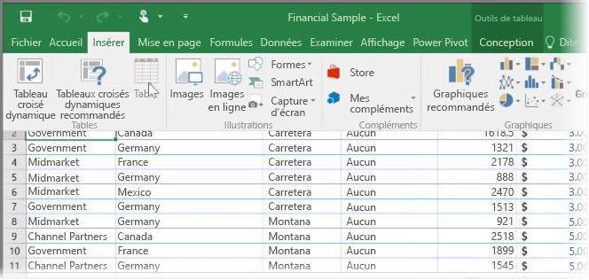
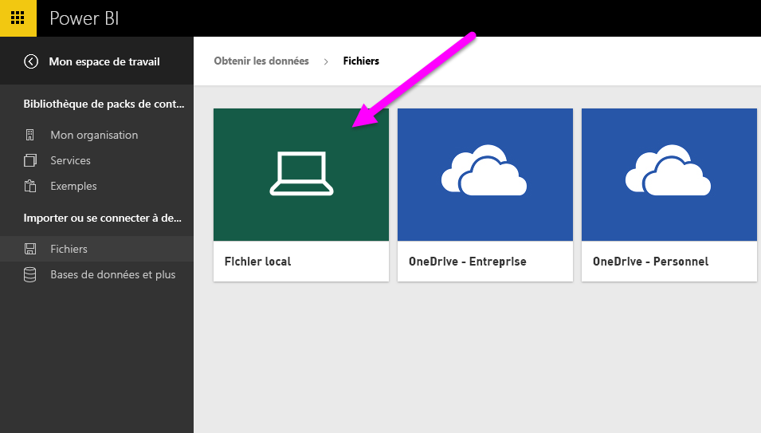
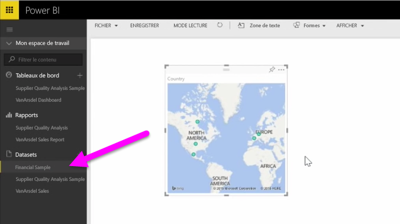

Dans cette rubrique, nous allons tout d’abord examiner comment vous pouvez importer un fichier de classeur Excel contenant un **tableau** simple à partir d’un lecteur local dans Power BI. Vous allez ensuite apprendre comment vous pouvez commencer à explorer les données de ce tableau dans Power BI en créant un rapport.

## Vérifier que vos données apparaissent sous la forme de tableau
Pour que Power BI importe des données à partir de votre classeur, ces données doivent être **présentées sous la forme d’un tableau**. C’est facile. Dans Excel, vous pouvez mettre en surbrillance une plage de cellules, puis sous l’onglet **Insertion** du ruban Excel, cliquer sur **Tableau**.

Vous voudrez vérifier que chaque colonne a un nom approprié. Cela facilite la recherche des données souhaitées lors de la création de vos rapports dans Power BI.

## Importer à partir d’un lecteur local
Quel que soit l’emplacement où vous conservez vos fichiers, Power BI facilite leur importation. Dans Power BI, vous pouvez utiliser **Obtenir les données** > **Fichiers** > **Fichier local** pour rechercher et sélectionner le fichier Excel souhaité.

Une fois l’importation effectuée dans Power BI, vous pouvez commencer la création de rapports.

Vos fichiers ne doivent pas nécessairement se trouver sur un lecteur local, bien sûr. Si vous enregistrez vos fichiers sur OneDrive ou un site d’équipe SharePoint, c’est encore mieux. Nous étudierons ce point plus en détail dans une prochaine rubrique.

## Commencer à créer des rapports
Une fois les données de votre classeur importées, un jeu de données est créé dans Power BI. Il s’affiche sous **Jeux de données**. Vous pouvez maintenant commencer à explorer vos données en créant des rapports et des tableaux de bord. Cliquez simplement sur l’icône **Ouvrir le menu** à côté du jeu de données, puis cliquez sur **Explorer**. Un nouveau canevas de rapport vide s’affiche. Sur la droite, sous **Champs**, vous pouvez voir vos tables et vos colonnes. Sélectionnez simplement les champs pour lesquels vous voulez créer une visualisation sur le canevas.

Vous pouvez modifier le type de visualisation et appliquer des **filtres** et d’autres propriétés sous **Visualisations**.

