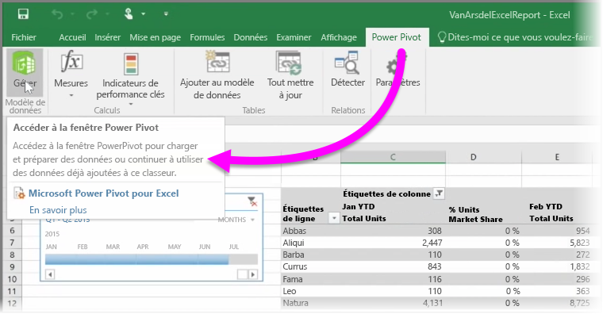

Si vous utilisez l’une des fonctionnalités BI avancées d’Excel telles que **Power Query** (appelée **Obtenir et transformer** dans Excel 2016) pour interroger et charger des données, **Power Pivot** pour créer des modèles de données puissants et **Power View** pour créer des rapports dynamiques, vous pouvez également les importer dans Power BI.

Si vous utilisez **Power Pivot** pour créer des modèles de données avancés, comme ceux comportant plusieurs tables associées, mesures, colonnes calculées et hiérarchies, Power BI importe aussi tous ces éléments.

Si votre classeur contient des **feuilles Power View**, aucun problème. Power BI les recrée sous forme de nouveaux **rapports** dans Power BI. Vous pouvez commencer immédiatement à épingler des visualisations sur des tableaux de bord.

Et Voici une des fonctionnalités de Power BI : Si vous utilisez Power Query ou Power Pivot pour vous connecter, interroger et charger des données à partir de la source de données externe, une fois que vous avez importé votre classeur dans Power BI, vous pouvez configurer **actualisation planifiée**. En utilisant l’actualisation planifiée, Power BI utilise les informations de connexion de votre classeur pour se connecter directement à la source de données, interroger des données qui ont été modifiées et les charger. Toutes les visualisations figurant dans les rapports sont aussi automatiquement actualisées.

