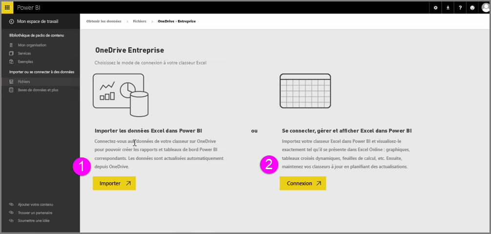
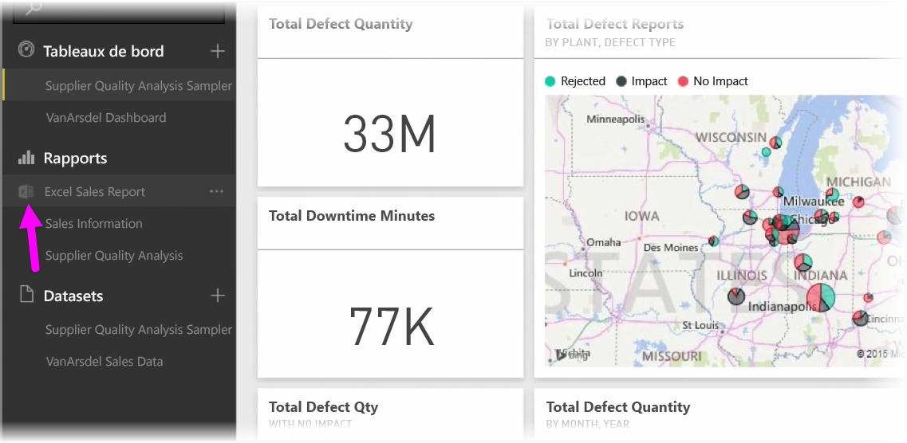
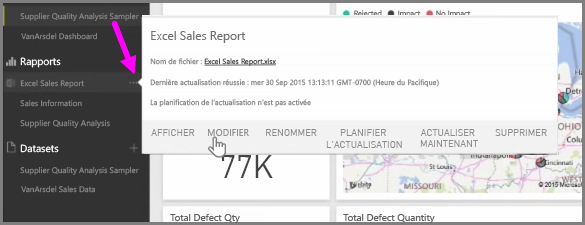

Obtenez une intégration transparente entre Power BI et Excel quand vous enregistrez vos classeurs Excel dans OneDrive.

Étant donné que OneDrive est dans le cloud, tout comme Power BI, une connexion active est établie entre Power BI et OneDrive. Si vous apportez des modifications à votre classeur sur OneDrive, ces modifications sont *automatiquement synchronisées* avec Power BI. Vos visualisations dans des rapports et des tableaux de bord sont automatiquement tenues à jour. Si votre classeur se connecte à des sources de données externes comme une base de données ou un flux OData, vous pouvez utiliser les fonctionnalités **Planifier l’actualisation** de Power BI pour vérifier la présence de mises à jour. Vous avez des questions à poser sur les données présentes dans votre classeur ? Aucun problème. Vous pouvez utiliser les fonctionnalités **Q&R** de Power BI justement pour cela.

Il existe deux façons de se connecter à vos fichiers Excel sur OneDrive Entreprise :

1. Importer les données Excel dans Power BI
2. Se connecter à Excel et le gérer et l'afficher dans Power BI

### Importer les données Excel dans Power BI
Quand vous choisissez d’importer des données Excel dans Power BI, les données de table provenant de votre classeur sont chargées dans un nouveau jeu de données dans Power BI. Si vous avez des feuilles **Power View** dans votre classeur, elles sont importées et de nouveaux rapports sont également automatiquement créés dans Power BI.

Power BI tient à jour la connexion entre lui-même et le fichier de classeur sur OneDrive Entreprise. Si vous apportez des modifications à votre classeur, quand vous enregistrez, ces modifications sont *automatiquement synchronisées** avec Power BI, généralement dans l’heure. Si votre classeur se connecte à des sources de données externes, vous pouvez configurer l’actualisation planifiée pour que le jeu de données dans Power BI soit tenu à jour. Étant donné que les visualisations dans les rapports et les tableaux de bord dans Power BI utilisent les données du jeu de données, vos requêtes sont très rapides quand vous effectuez une exploration.

### Se connecter, gérer et afficher Excel dans Power BI
Quand vous choisissez de vous connecter au classeur Excel, vous utilisez votre classeur dans Excel et Power BI en toute transparence. Quand vous vous connectez de cette façon, une petite icône Excel s’affiche en regard du rapport du classeur.

Dans le rapport, vous voyez votre classeur Excel dans Power BI comme vous le verriez dans **Excel Online**. Vous pouvez explorer et modifier vos feuilles de calcul dans Excel Online en sélectionnant Modifier dans le menu ... (Points de suspension). Quand vous apportez des modifications, les visualisations que vous avez épinglées aux tableaux de bord sont automatiquement mises à jour.

Aucun jeu de données n’est créé dans Power BI. Toutes les données restent dans le classeur sur OneDrive. L’un des nombreux avantages de cette approche tient dans le fait que vous pouvez configurer une **actualisation planifiée** si votre classeur se connecte à des sources de données externes. Vous pouvez sélectionner des éléments tels que des tableaux croisés dynamiques et des graphiques, et les **épingler** directement aux tableaux de bord dans Power BI. Si vous apportez des modifications, elles sont automatiquement reflétées dans Power BI. Et vous pouvez utiliser les formidables fonctionnalités **Q&R** de Power BI pour poser des questions sur les données contenues dans votre classeur.  

