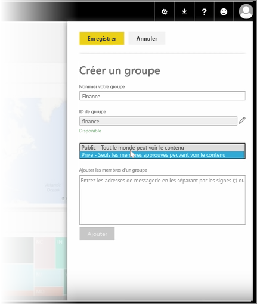
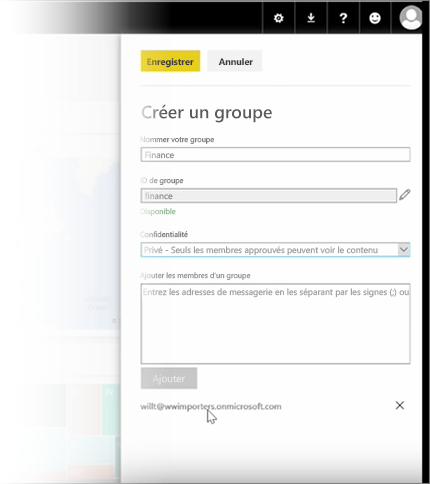

Dans cette leçon, nous commençons par créer un *groupe*. Un **groupe** définit un ensemble d’utilisateurs qui ont accès à des tableaux de bord, à des rapports et à des données spécifiques.

Dans Power BI, les groupes sont basés sur les groupes dans Office 365. Par conséquent, si vous utilisez les groupes Office 365 pour gérer l’e-mail, le calendrier et les documents de votre groupe, vous verrez que Power BI offre les mêmes fonctionnalités, et plus encore. Quand vous créez un groupe dans Power BI, vous créez en fait un groupe Office 365.

Ce module utilise le scénario de configuration d’un nouveau groupe financier. Nous allons montrer comment configurer le groupe, partager des tableaux de bord, des rapports et des jeux de données dans le groupe, puis ajouter des membres qui auront accès aux éléments du groupe.

Je commence ici dans Mon espace de travail. Voici les tableaux de bord, les rapports et les jeux de données que j’ai créés ou que quelqu’un a partagés avec moi.

Si je développe Mon espace de travail, je peux sélectionner **Créer un groupe**.

Ici, je peux lui donner un nom. Nous utilisons le scénario d’un groupe financier, donc je vais l’appeler Finance. Power BI vérifie que le nom n’existe pas sur le domaine.

Je peux définir le niveau de confidentialité en décidant si n’importe quelle personne de mon organisation peut voir le contenu du groupe, ou seulement ses membres.

Je tape les adresses e-mail, les groupes de sécurité et les listes de distribution ici. Je sélectionne **Ajouter** pour en faire des membres du groupe et enregistrer le groupe.

Passons à la leçon suivante !

