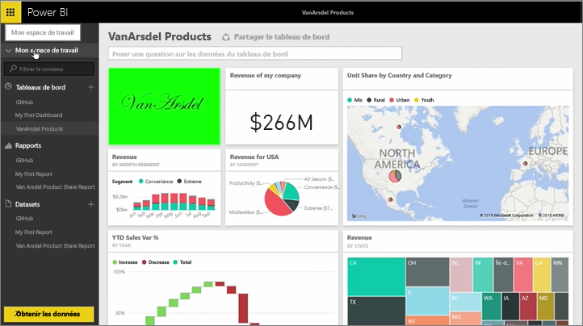
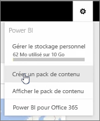
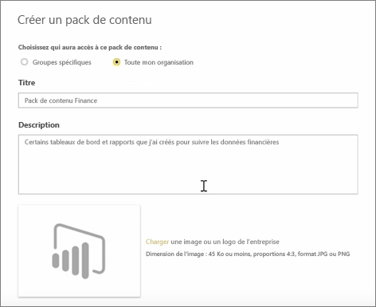
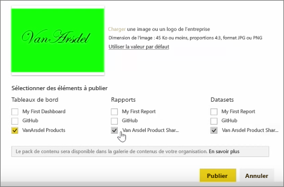
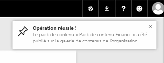

Dans cette leçon, nous allons créer un *pack de contenu* avec des artefacts existants dont nous disposons déjà dans Power BI, puis les partager avec des collègues.

Dans **Mon espace de travail**, je dispose d’un tableau de bord, du rapport ci-dessous et du groupe de données. Je veux les partager sous la forme d’un package avec les personnes de mon organisation, afin qu’elles puissent les réutiliser.

Quand je sélectionne l’icône **Paramètres** (l’engrenage en haut à droite du service), je peux voir la quantité de stockage que j’ai utilisée, et je peux créer un pack de contenu.

Dans la boîte de dialogue qui s’affiche, je peux choisir de le distribuer à des personnes ou à des groupes, et aussi de lui donner un titre. Il est également judicieux de fournir une description détaillée dans la zone **Description**, pour que les personnes qui parcourent un pack de contenu sachent ce qu’il contient ou ce qu’il fournit.

En bas de la boîte de dialogue, j’ai la possibilité de charger une image pour le pack de contenu. Vient alors l’étape la plus importante : je sélectionne le tableau de bord que je veux inclure dans le pack de contenu, et quand je fais cela, Power BI sélectionne automatiquement le rapport et le jeu de données qui sont utilisés dans le tableau de bord. Je ne peux pas désélectionner le rapport ou le jeu de données, car le tableau de bord que je veux inclure dans le pack de contenu en a besoin.

Je pourrais également sélectionner d’autres tableaux de bord, d’autres rapports et d’autres jeux de données, mais je ne vais pas le faire maintenant.

Quand j’effectue la publication, le pack de contenu est ajouté à la galerie de contenus de l’organisation.

Passons à la leçon suivante !

