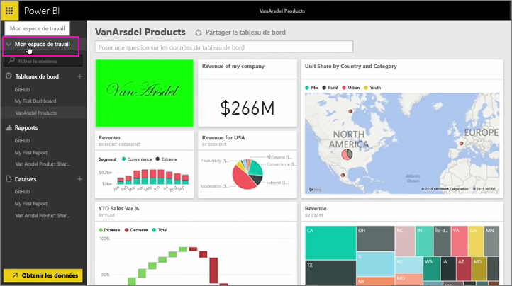
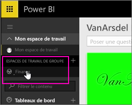
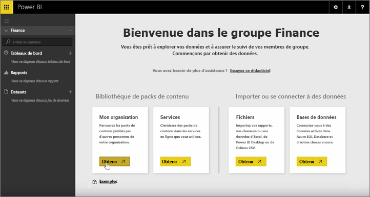
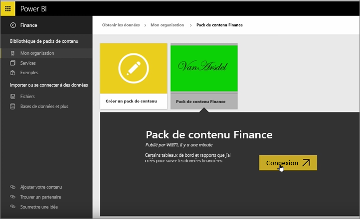
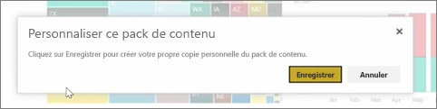
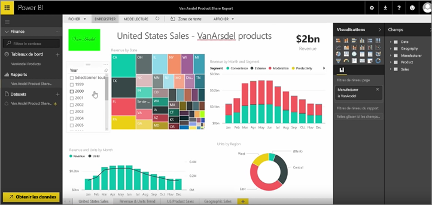

Dans les leçons précédentes, nous avons déjà créé un pack de contenu et un groupe. Dans cette leçon, nous allons créer une instance du pack de contenu pour chaque membre du groupe.

Je commence dans Mon espace de travail,...

... et je reviens au groupe Finance que j’ai créé dans la leçon précédente.

Le groupe n’a pas encore de tableaux de bord, de rapports ou de jeux de données. Je vais utiliser l’application que j’ai créé. Applications pour naviguer à partir de mon organisation plutôt que ceux à partir des services tiers.

Trouver l’application que j’ai créé une minute auparavant. Je vois pourquoi il est important de lui donner un titre, une description et une image appropriés, afin que les utilisateurs puissent le trouver. Je m’y connecte.

Power BI importe les tableaux de bord, rapports et jeux de données qui se trouvent dans l’application.

Lorsque je sélectionne le jeu de données, Power BI vous demande si je veux personnaliser l’application.

Je suis création d’une copie de l’application que je peux apporter des modifications et déconnecter de la version publiée de l’application. Si le créateur de l’application apporte des modifications à la version publiée, j’obtiendrai pas automatiquement les mises à jour.

Mais je peux modifier le tableau de bord, le rapport et même le jeu de données, si je le souhaite.

Par conséquent, application sont un moyen simple de réutiliser du contenu créé par d’autres personnes de votre organisation.

Passons à la leçon suivante !

