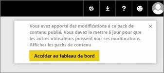
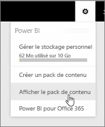
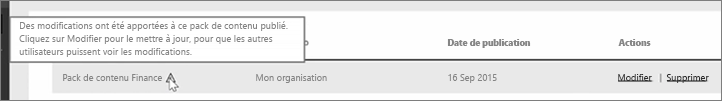

Dans cette leçon, nous allons modifier l’application d’origine que vous avez créée précédemment et voir comment qui met à jour les autres personnes qui y sont connectées.

Je suis de retour dans Mon espace de travail, où je modifie mon tableau de bord d’origine.

Chaque fois que j’apporte une modification au tableau de bord, j’obtiens ce rappel que j’ai modifié quelque chose que j’ai partagé avec d’autres utilisateurs dans une application, et je suis invité à mettre à jour de la version partagée.

J’ai revenir en arrière à l’icône des paramètres et sélectionnez **application avec affichage** pour voir les applications que j’ai déjà publié.

Je vois l’application que j’ai apporté. Cette petite icône m’indique que j’ai modifié quelque chose dans l’application, et j’ai besoin de modifier l’application pour que d’autres personnes puissent voir mes modifications.

Le fait de sélectionner **Modifier** me ramène dans l’écran où je peux modifier le titre et la description, mais cette fois, il a un bouton **Mettre à jour**. Donc, je le sélectionne.

Power BI prend ces modifications et publie l’application mis à jour dans la galerie d’applications.

Toute personne qui s’est connecté à mon application obtient un message que l’application a changé et vous demande s’il souhaite accepter les modifications ou conserver l’ancienne version.

Par conséquent, en tant que propriétaire de l’application, vous pouvez gérer les versions à l’aide de vos collègues.

