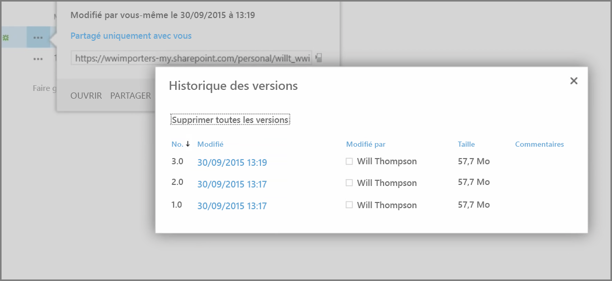
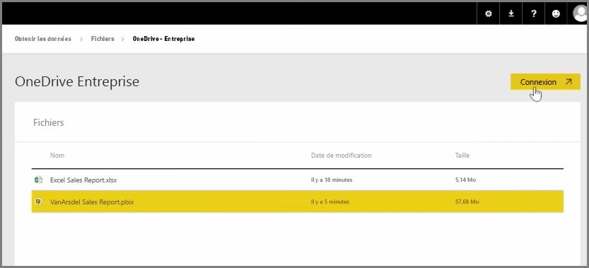
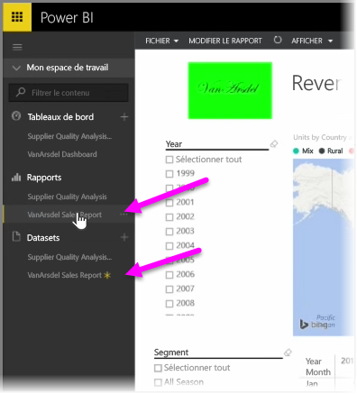

Dans un article précédent, nous avons vu comment créer des groupes pour permettre à votre organisation de gérer le contenu de Power BI et de collaborer sur ce contenu. Vous pouvez également utiliser vos groupes Power BI/Office 365 pour collaborer et partager à l’aide de **OneDrive Entreprise**.

L’utilisation de OneDrive Entreprise comme source pour votre contenu Power BI vous permet d’accéder à un certain nombre d’outils utiles, tels que l’historique des versions. Vous pouvez également partager vos fichiers avec un groupe Office 365 à partir de OneDrive Entreprise pour accorder l’accès et autoriser d’autres personnes à travailler sur les mêmes fichiers Power BI ou Excel.

Pour vous connecter à un fichier PBIX (Power BI Desktop) sur OneDrive Entreprise, connectez-vous au service Power BI et sélectionnez **Obtenir les données**. Choisissez **Fichiers** sous Importer ou se connecter à des données, puis sélectionnez **OneDrive - Entreprise**. Mettez en surbrillance le fichier souhaité, puis sélectionnez **Se connecter**.

Votre contenu s’affiche dans la barre de navigation de gauche.

Maintenant, toutes les modifications apportées au fichier sur **OneDrive Entreprise** sont aussi automatiquement répercutées dans l’environnement Power BI et enregistrées dans l’historique des versions.

