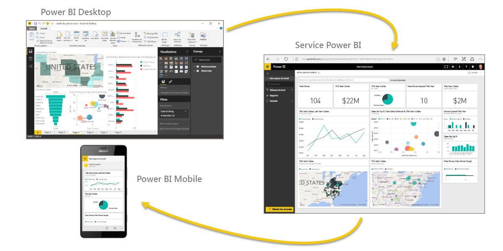
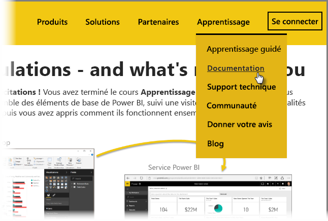

Vous avez réussi ! **Félicitations !** Vous avez terminé le cours **Formation guidée** pour Power BI. Vous avez découvert l’ensemble des éléments de base de Power BI, suivi une visite guidée de ses fonctionnalités et éléments logiciels, puis vous avez appris comment ils fonctionnent ensemble.

Voici la dernière section (et la dernière rubrique, à moins que vous ne souhaitiez également apprendre DAX) du cours. Par conséquent, si vous avez parcouru toutes ces sections dans l’ordre, prenez un moment pour vous féliciter. Bravo ! Vous êtes maintenant familiarisé avec tous les **concepts importants** suivants :

* À quoi sert [Power BI](../gettingstarted.yml#step-1)
* [Éléments essentiels ](../gettingstarted.yml#step-3) de Power BI
* [Obtention](../gettingdata.yml#step-3) et [modélisation](../modeling.yml#step-1) de données
* [Visualisations](../visualizations.yml#step-1)
* [Exploration de données](../exploringdata.yml#step-1) dans le service Power BI
* Utilisation conjointe d’[Excel et de Power BI](../powerbiandexcel.yml#step-1)
* Et [publication et partage](../publishingandsharing.yml#step-1) de votre travail

Cela représente beaucoup d’informations, mais maintenant que vous avez tout cela en tête, vous allez pouvoir vous lancer et les mettre à profit ! Voici quelques **liens vers des téléchargements** ou pour **connecter votre navigateur au service Power BI** :

* Vous pouvez [obtenir la dernière version de Power BI Desktop](https://powerbi.microsoft.com/desktop) à tout moment
* Il est facile de se diriger vers le [service Power BI](https://powerbi.microsoft.com/)
* Il vous suffit d’appuyer sur votre écran pour obtenir des [applications mobiles pour Power BI](https://powerbi.microsoft.com/mobile/)

Du contenu d’**aide et de référence** supplémentaire est également disponible. Allez simplement en haut de cette page, puis sélectionnez **Formation > Documentation** pour voir notre ensemble complet de références Power BI.

Nous espérons que vous avez apprécié notre **Formation guidée sur Power BI**. Bonne chance à vous. Je vous souhaite de créer des éléments visuels Power BI toujours réalistes et attrayants.

## Section supplémentaire pour les utilisateurs DAX
Vous voulez en apprendre plus ? Vous souhaitez utiliser **DAX (Data Analysis Expressions)** pour créer, filtrer ou utiliser des tables et des colonnes personnalisées dans Power BI ? Une section supplémentaire intitulée **Présentation de DAX** a été prévue pour les personnes qui veulent coder dans Power BI. Consultez-la si cela vous intéresse. Elle est basée sur la même approche conviviale que le reste de la formation guidée.

