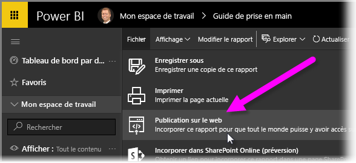
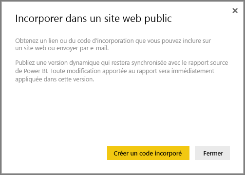
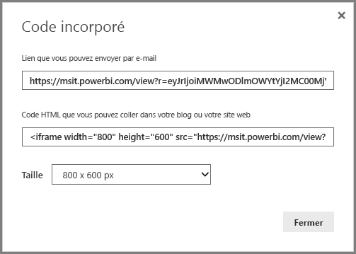
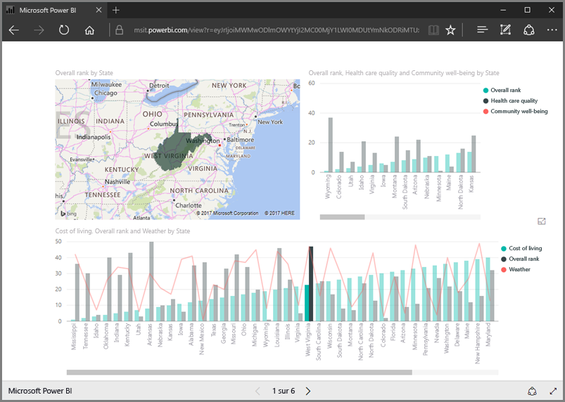
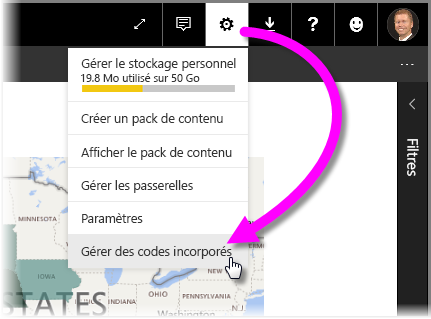
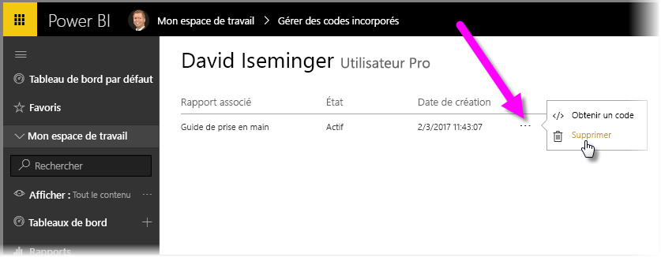

Cette leçon explique comment partager un rapport Power BI sur une page web ou le partager par courrier électronique en quelques étapes simples. Cette fonctionnalité de Power BI, souvent appelée **Publier sur le web**, est facile à utiliser et à gérer.

Dans Power BI, sélectionnez le rapport à partager afin de l’afficher dans la zone de dessin. Ensuite, dans le menu, sélectionnez **Fichier > Publier sur le web**.

À partir de là, vous voyez s’afficher une boîte de dialogue expliquant que vous allez obtenir un *code d’incorporation* permettant d’inclure le rapport sur un site web ou dans un courrier électronique.

Lorsque vous sélectionnez **Créer un code incorporé**, Power BI affiche une autre boîte de dialogue vous informant à nouveau que vous êtes sur le point de partager vos données avec tout le monde sur Internet. Assurez-vous que c’est bien le cas.

Power BI affiche une boîte de dialogue contenant deux liens :

* un lien que vous pouvez partager par courrier électronique, qui affiche le rapport sous la forme d’une page web ;
* un code HTML (un lien à l’intérieur d’un IFrame) permettant d’incorporer le rapport directement dans une page web.

Pour le lien HTML, vous pouvez choisir parmi des tailles prédéfinies pour le rapport incorporé, ou modifier vous-même le code iframe et personnaliser sa taille.

Vous pouvez simplement coller le lien de courrier électronique dans un navigateur et afficher votre rapport en tant que page web. Vous pouvez interagir avec cette page comme vous le feriez si vous affichiez le rapport dans Power BI. L’image suivante montre une page **Publier sur le web** dont le lien a été copié directement à partir de cette boîte de dialogue dans un navigateur :

Vous pouvez également incorporer ce lien IFrame dans un billet de blog, un site web ou un Sway.

Vous voulez supprimer un code d’incorporation que vous avez créé ? Aucun problème. Dans Power BI, sélectionnez l’icône d’**engrenage** dans l’angle supérieur droit, puis choisissez **Gérer les codes d'incorporation**.

L’espace de travail de Power BI affiche les codes d'incorporation que vous avez créés (l’image ci-dessous n’en contient qu’un seul). Lorsque vous cliquez sur les points de suspension, vous pouvez choisir d’obtenir le code d'incorporation ou de le supprimer entièrement.

Cela suffit pour publier votre rapport Power BI sur le web et le partager avec tout le monde. C’est facile.

