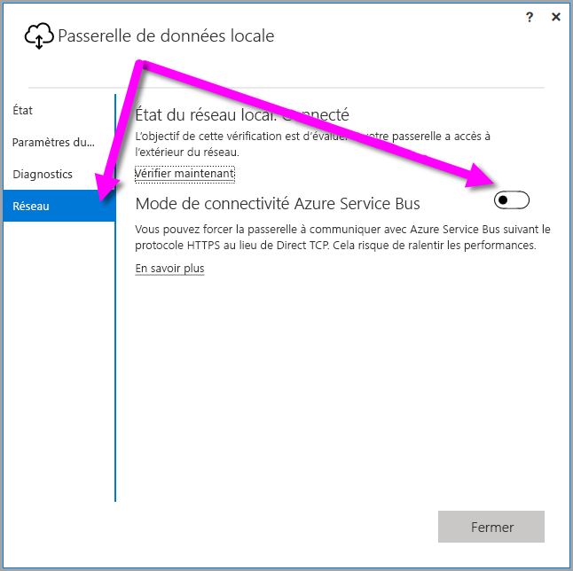
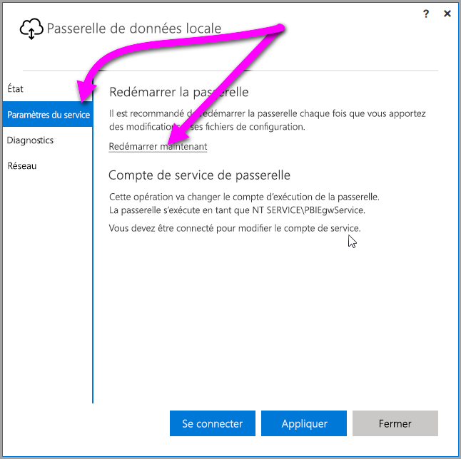

## <a name="sign-in-account"></a>Compte de connexion

Les utilisateurs se connectent en utilisant un compte professionnel ou scolaire. Il s’agit du **compte de votre organisation**. Si vous avez souscrit une offre Office 365 et que vous n’avez pas fourni votre adresse de messagerie professionnelle, il peut ressembler à nancy@contoso.onmicrosoft.com. Votre compte est stocké dans un locataire, dans Azure Active Directory (AAD). Généralement, le nom d’utilisateur principal (ou UPN) de votre compte AAD correspond à votre adresse de messagerie.

## <a name="windows-service-account"></a>Compte de service Windows

La passerelle de données locale est configurée pour utiliser *NT SERVICE\PBIEgwService* pour les informations d’identification de connexion au service Windows. Par défaut, elle a le droit de connexion en tant que service, dans le contexte de l’ordinateur sur lequel vous installez la passerelle. Il ne s’agit pas du compte utilisé pour se connecter aux sources de données locales. Il ne s’agit pas non plus du compte professionnel ou scolaire que vous utilisez pour vous connecter aux services cloud.

> [!NOTE]
> Si vous avez sélectionné le mode Personal, vous devez configurer le compte de service Windows séparément.

Si vous rencontrez des problèmes d’authentification avec votre serveur proxy, essayez de remplacer le compte de service Windows par un compte d’utilisateur de domaine ou de service administré. Pour plus d’informations, consultez [Configuration du proxy](../service-gateway-proxy.md#changing-the-gateway-service-account-to-a-domain-user).

## <a name="ports"></a>Ports

La passerelle crée une connexion sortante vers Azure Service Bus. Elle communique sur des ports de sortie : TCP 443 (valeur par défaut), 5671, 5672, 9350 à 9354.  La passerelle ne nécessite pas de ports d’entrée.

Nous vous recommandons d’ajouter les adresses IP de votre région de données à une liste verte dans votre pare-feu. Vous pouvez télécharger la [liste d’adresses IP des centres de données Microsoft Azure](https://www.microsoft.com/download/details.aspx?id=41653), qui est mise à jour chaque semaine. Vous pouvez également obtenir la liste des ports nécessaires en effectuant un [test des ports réseau](../service-gateway-onprem-tshoot.md#network-ports-test) sur l’application de passerelle de données locale. La passerelle communique avec Azure Service Bus à l’aide de l’adresse IP et du nom de domaine complet. Si vous forcez la passerelle à communiquer à l’aide de HTTPS, elle utilise uniquement un nom de domaine complet et aucune communication n’est établie au moyen des adresses IP.


> [!NOTE]
> Les adresses IP répertoriées dans la liste d’adresses IP du centre de données Azure sont en notation CIDR. Par exemple, 10.0.0.0/24 ne signifie pas de 10.0.0.0 à 10.0.0.24. En savoir plus sur la notation [CIDR](http://whatismyipaddress.com/cidr).

Voici la liste des noms de domaine complets utilisés par la passerelle.

| Noms de domaine | Ports de sortie | Description |  |
|-----------------------------|----------------|--------------------------------------------------------------------------------------------------------------------|---|
| *.download.microsoft.com | 80 | Utilisé pour télécharger le programme d’installation. Il est également utilisé par l’application de passerelle de données pour vérifier la version et la région de la passerelle. |  |
| *.powerbi.com | 443 | Utilisé pour identifier le cluster Power BI approprié. |  |
| *.analysis.windows.net | 443 | Utilisé pour identifier le cluster Power BI approprié. |  |
| *.login.windows.net | 443 | Utilisé pour l’authentification de l’application de passerelle de données auprès d’Azure Active Directory/OAuth2. |  |
| *.servicebus.windows.net | 5671-5672 | Utilisé pour AMQP (Advanced Message Queuing Protocol). |  |
| *.servicebus.windows.net | 443, 9350-9354 | Utilisé par les écouteurs sur Service Bus Relay via TCP (nécessite le port 443 pour l’acquisition de jeton de contrôle d’accès). |  |
| *.frontend.clouddatahub.net | 443 | Déprécié (désormais inutile). Sera prochainement supprimé de la documentation. |  |
| *.core.windows.net | 443 | Utilisé par les flux de données dans Power BI pour écrire des données dans Azure Data Lake. |  |
| login.microsoftonline.com | 443 | Utilisé pour l’authentification de l’application de passerelle de données auprès d’Azure Active Directory/OAuth2. |  |
| *.msftncsi.com | 443 | Utilisé pour tester la connectivité Internet et voir si la passerelle n’est pas accessible par le service Power BI. |  |
| *.microsoftonline-p.com | 443 | Utilisé pour l’authentification de l’application de passerelle de données auprès d’Azure Active Directory/OAuth2. |  |
| | |

> [!NOTE]
> Une fois que la passerelle est installée et inscrite, les seuls ports et adresses IP nécessaires sont ceux dont a besoin Azure Service Bus (servicebus.windows.net ci-dessus). Vous pouvez obtenir la liste des ports nécessaires en effectuant un [test des ports réseau](../service-gateway-onprem-tshoot.md#network-ports-test) sur l’application de passerelle de données locale.

## <a name="forcing-https-communication-with-azure-service-bus"></a>Forcer les communications HTTPS avec Azure Service Bus

Vous pouvez forcer la passerelle à communiquer avec Azure Service Bus suivant le protocole HTTPS au lieu de Direct TCP.

> [!NOTE]
> À compter de la version de juin 2019, les nouvelles installations (pas les mises à jour) ont HTTPS comme valeur par défaut au lieu de TCP, conformément aux recommandations d’Azure Service Bus.

Pour forcer la communication sur HTTPS, modifiez le fichier *Microsoft.PowerBI.DataMovement.Pipeline.GatewayCore.dll.config* en remplaçant la valeur `AutoDetect` par `Https`, comme indiqué dans l’extrait de code qui suit directement ce paragraphe. Par défaut, ce fichier se trouve dans le dossier *C:\Program Files\Passerelle de données locale*.

```xml
<setting name="ServiceBusSystemConnectivityModeString" serializeAs="String">
    <value>Https</value>
</setting>
```

La valeur du paramètre *ServiceBusSystemConnectivityModeString* respecte la casse. Les valeurs valides sont *AutoDetect* et *Https*.

Vous pouvez également forcer la passerelle à adopter ce comportement à l’aide de l’interface utilisateur associée. Dans l’interface utilisateur de la passerelle, sélectionnez **Réseau**, puis définissez le paramètre **Mode de connectivité Azure Service Bus** sur **Activé**.



Une fois les modifications effectuées, lorsque vous sélectionnez **Appliquer** (un bouton qui n’apparaît que lorsque vous apportez une modification), le *service Windows de passerelle* redémarre automatiquement afin que la modification puisse prendre effet.

Pour référence future, vous pouvez redémarrer le *service Windows de passerelle* à partir de la boîte de dialogue d’interface utilisateur en sélectionnant **Paramètres de service**, puis *Redémarrer maintenant*.



## <a name="support-for-tls-12"></a>Prise en charge de TLS 1.2

Par défaut, la passerelle de données locale utilise le protocole TLS (Transport Layer Security) 1.2 pour communiquer avec le service Power BI. Pour que tout le trafic de passerelle utilise bien le protocole TLS 1.2, il vous faudra peut-être ajouter ou modifier les clés de Registre suivantes sur l’ordinateur exécutant le service de passerelle :

```
[HKEY_LOCAL_MACHINE\SOFTWARE\Microsoft\.NETFramework\v4.0.30319]"SchUseStrongCrypto"=dword:00000001
[HKEY_LOCAL_MACHINE\SOFTWARE\Wow6432Node\Microsoft\.NETFramework\v4.0.30319]"SchUseStrongCrypto"=dword:00000001
```

> [!NOTE]
> L’ajout ou la modification de ces clés de Registre s’appliquent à toutes les applications .NET. Pour plus d’informations sur les modifications du Registre qui affectent le protocole TLS pour d’autres applications, voir [Paramètres de Registre pour le protocole TLS](https://docs.microsoft.com/windows-server/security/tls/tls-registry-settings).

## <a name="how-to-restart-the-gateway"></a>Comment redémarrer la passerelle

La passerelle s’exécute en tant que service Windows. Vous pouvez la démarrer et l’arrêter comme n’importe quel service Windows. Voici comment faire à partir de l’invite de commandes.

1. Sur l’ordinateur sur lequel la passerelle est en cours d’exécution, lancez une invite de commandes d’administration.
2. Utilisez la commande suivante pour arrêter le service.
   
   net stop PBIEgwService
3. Utilisez la commande suivante pour démarrer le service.
   
   net start PBIEgwService

