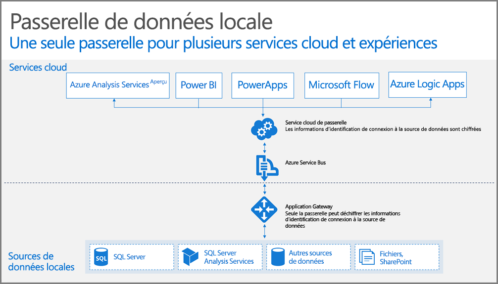

## Fonctionnement de la passerelle

Commençons par examiner ce qui se passe quand un utilisateur interagit avec un élément connecté à une source de données locale. 

> [!NOTE]
> Pour Power BI, vous devez configurer une source de données pour la passerelle.
> 
> 

1. Une requête est créée par le service cloud, avec les informations d’identification chiffrées de la source de données locale, puis transmise à la file d’attente de la passerelle à traiter.
2. Le service cloud de passerelle analyse la requête et transmet la demande à [Azure Service Bus](https://azure.microsoft.com/documentation/services/service-bus/).
3. La passerelle de données locale interroge [Azure Service Bus](https://azure.microsoft.com/documentation/services/service-bus/) pour obtenir les demandes en attente.
4. La passerelle récupère la requête, déchiffre les informations d’identification et se connecte aux sources de données avec ces informations d’identification.
5. Elle envoie la requête à la source de données afin de l’exécuter.
6. Les résultats sont renvoyés à la passerelle, depuis la source de données, puis sur le service cloud. Le service utilise ensuite les résultats.

