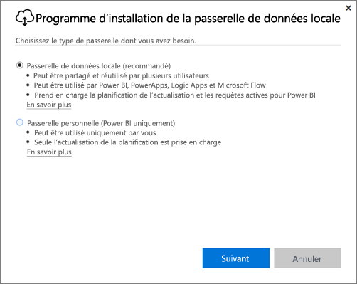
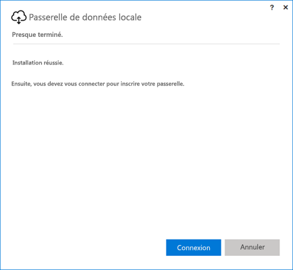
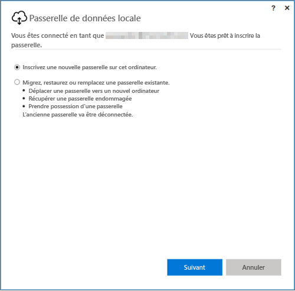
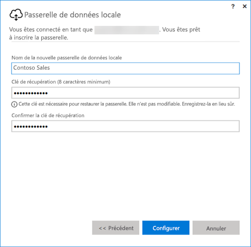

## Installer la passerelle de données locale
La passerelle de données installe et s’exécute sur votre ordinateur. Il est préférable d’installer la passerelle sur un ordinateur qui peut être laissé allumé en continu.

> [!NOTE]
> La passerelle est prise en charge uniquement sur les systèmes d’exploitation Windows 64 bits.
> 
> 

Si vous utilisez Power BI, le premier choix que vous avez à faire concerne le mode de la passerelle.

* **Passerelle de données locale :** avec ce mode, plusieurs utilisateurs peuvent partager et réutiliser une passerelle. Cette passerelle peut être utilisée par Power BI, PowerApps, Flow ou Logic Apps. Si vous utilisez Power BI, une prise en charge est incluse pour l’actualisation planifiée et DirectQuery
* **Personnel :** ce mode concerne uniquement Power BI. Il permet d’utiliser la passerelle en tant qu’individu, sans aucune configuration de l’administrateur. Ce mode peut uniquement servir pour l’actualisation à la demande et l’actualisation planifiée. Cette sélection lance l’installation de la passerelle personnelle.

Il existe quelques aspects à prendre en compte lors de l’installation d’un des modes de la passerelle :

* Les deux passerelles requièrent des systèmes d’exploitation Windows 64 bits.
* Vous ne pouvez pas installer les passerelles sur un contrôleur de domaine.
* Vous pouvez installer jusqu’à deux passerelles de données locales sur le même ordinateur, une dans chaque mode (personnel et standard). 
* Vous ne pouvez pas avoir plusieurs passerelles exécutées dans le même mode sur le même ordinateur.
* Vous pouvez installer plusieurs passerelles de données locales sur différents ordinateurs, et les gérer toutes à partir de la même interface de gestion de passerelle Power BI (à l’exception du mode personnel, comme expliqué au point suivant).
* Vous ne pouvez avoir qu’une seule passerelle en mode personnel en cours d’exécution pour chaque utilisateur Power BI. Si vous installez une autre passerelle en mode personnel pour le même utilisateur, même sur un autre ordinateur, l’installation la plus récente remplace la précédente installation.

Voici quelques éléments à prendre en compte avant d’installer la passerelle.

* Si vous procédez à l’installation sur un ordinateur portable et que ce dernier est éteint, non connecté à Internet ou mis en veille par la suite, la passerelle ne fonctionne plus et les données du service cloud ne sont pas synchronisées avec vos données locales.
* Si votre ordinateur est connecté à un réseau sans fil, la passerelle peut être ralentie, ce qui augmente la durée de la synchronisation des données du service cloud vers vos données locales.

Lorsque la passerelle est installée, vous devez vous connecter avec votre compte professionnel ou scolaire.

Lorsque vous êtes connecté, vous pouvez configurer une passerelle. Vous pouvez également migrer, restaurer ou reprendre une passerelle existante.

## Configurer une nouvelle passerelle
1. Entrez le **nom** de la passerelle.
2. Entrez une **clé de récupération**. Elle doit contenir au moins 8 caractères.
3. Sélectionnez **Configurer**.

> [!NOTE]
> La clé de récupération est nécessaire si vous devez migrer, restaurer ou reprendre une passerelle. Veuillez la conserver en lieu sûr.
> 
> 

### Migrer, restaurer ou reprendre une passerelle existante
Vous devez sélectionner la passerelle que vous souhaitez récupérer et fournir la clé de récupération définie lors de sa création.

### Passerelle de données locale connectée
Une fois la passerelle configurée, vous pouvez l’utiliser pour vous connecter aux sources de données locales.

Si vous utilisez la passerelle avec Power BI, vous devez ajouter vos sources de données à la passerelle dans le service Power BI. Cette opération se fait dans la zone **Gérer les passerelles**. Pour plus d’informations, vous pouvez consulter les articles sur la gestion des sources de données.

Si vous utilisez PowerApps, vous devez sélectionner une passerelle pour une connexion définie pour les sources de données prises en charge. Si vous utilisez Flow et Logic Apps, cette passerelle peut être utilisée avec les connexions locales.

