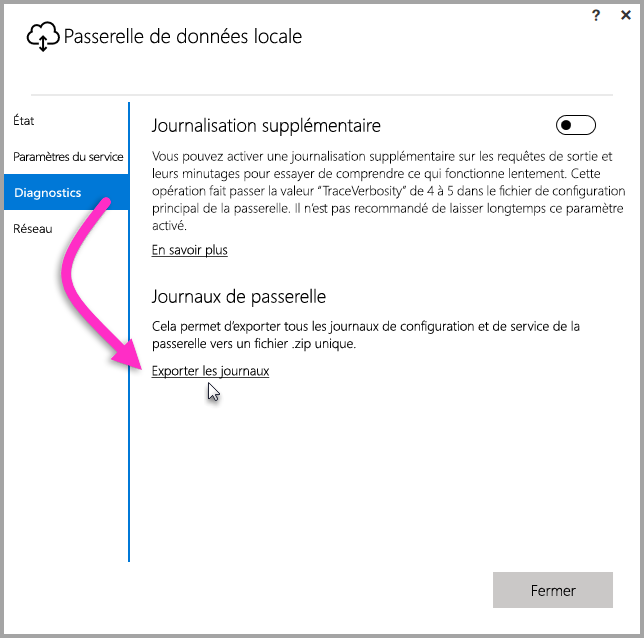
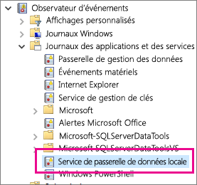

## Outils de résolution des problèmes
<a name="logs" />

### Collecte de journaux à partir de l’outil de configuration de passerelle
Il existe plusieurs journaux que vous pouvez collecter pour la passerelle et vous devez toujours commencer avec eux. L’interface utilisateur est le moyen le plus simple de collecter des journaux après l’installation de la passerelle. Dans l’interface utilisateur **Passerelle de données locale**, sélectionnez **Diagnostics**, puis le lien **Exporter les journaux** vers le bas de la page, comme indiqué dans l’image suivante.

**Journaux du programme d’installation**

    %localappdata%\Temp\On-premises_data_gateway_*.log

**Journaux de configuration**

    %localappdata%\Microsoft\on-premises data gateway\GatewayConfigurator*.log

**Journaux du service de passerelle de données locale**

    C:\Users\PBIEgwService\AppData\Local\Microsoft\on-premises data gateway\Gateway*.log

### Journaux d’événements
Les journaux d’événements du **service de passerelle de données locale** se trouvent à l’emplacement **Journaux des applications et des services**.

<a name="fiddler" />

### Trace Fiddler
[Fiddler](http://www.telerik.com/fiddler) est un outil gratuit de Telerik qui surveille le trafic HTTP.  Vous pouvez voir les allers et retours au niveau du service Power BI à partir de l’ordinateur client. Vous pouvez ainsi repérer les erreurs et d’autres informations connexes.

