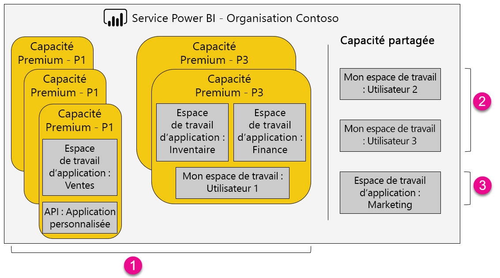

1. Éléments d’une capacité Premium
   
   * L’accès à des espaces de travail d’application (en tant que membres ou administrateurs) et la publication d’applications nécessitent une licence Power BI Pro.

   * Une licence Pro est nécessaire pour partager une application, mais pas pour l’utiliser.

   * Tous les destinataires du tableau de bord, quelle que soit la licence qui leur est attribuée, peuvent définir des alertes de données.

   * Les API REST d’incorporation utilisent un compte de service avec une licence Pro, et non un compte d’utilisateur.

2. Mon espace de travail en mode Capacité partagée
   
   * Le partage et l’utilisation d’une application nécessitent une licence Pro.

3. Espaces de travail d’applications en mode Capacité partagée
   
   * L’utilisation d’une application nécessite une licence Pro.

