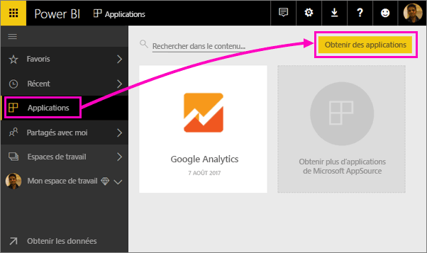
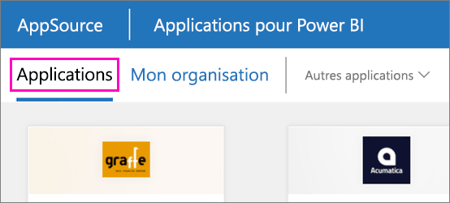

1. Dans le volet de navigation de gauche, sélectionnez **Applications**, puis, dans l’angle supérieur droit, choisissez **Obtenir des applications**.
   
     
2. Dans AppSource, sélectionnez l’onglet **Applications**, puis recherchez le service souhaité.
   
    

