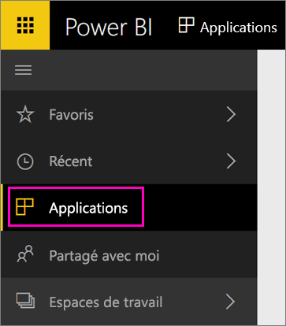

Une fois l’importation terminée, la nouvelle application apparaît sur la page Applications.

1. Dans le volet de navigation de gauche, sélectionnez **Applications**, puis l’application.
   
     
2. Vous pouvez poser une question en tapant dans la zone Q&R, ou cliquer sur une vignette pour ouvrir le rapport sous-jacent. 

