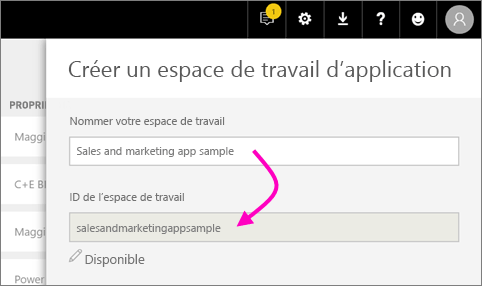
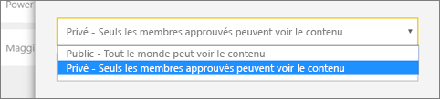
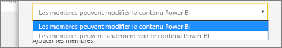
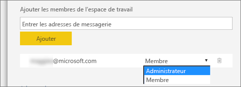

1. Commencez par créer l’espace de travail. Sélectionnez **Espaces de travail** > **Créer un espace de travail**. 
   
     
   
    C’est ici que vous allez placer le contenu sur lequel vous et vos collègues travaillez.

2. Dans la bannière **Vous créez un espace de travail mis à niveau**, cliquez sur **Revenir à la version classique**. 

    

3. Nommez l’espace de travail. Si l’**ID d’espace de travail** correspondant n’est pas disponible, modifiez-le de façon à obtenir un ID unique.
   
     L’application aura le même nom.
   
     

3. Vous devez définir quelques options. Si vous choisissez **Public**, toute personne au sein de votre organisation peut voir le contenu de l’espace de travail. **Privé** signifie que seuls les membres de l’espace de travail peuvent en voir le contenu.
   
     
   
    Vous ne pouvez pas modifier le paramètre Public/Privé après avoir créé le groupe.

4. Vous pouvez également spécifier si les membres peuvent **apporter des modifications** ou consulter en **lecture seule**.
   
     
   
     Ajoutez des utilisateurs à l’espace de travail pour qu’ils puissent modifier le contenu. S’il consulte uniquement le contenu, ne l’ajoutez pas à l’espace de travail. Vous pouvez l’inclure lorsque vous publiez l’application.

5. Ajouter les adresses e-mail des personnes qui doivent avoir accès à l’espace de travail, puis sélectionnez **Ajouter**. Vous ne pouvez ajouter d’alias de groupe, uniquement des individus.

6. Décidez pour chaque personne si celle-ci est membre ou administrateur.
   
     
   
    Les administrateurs peuvent modifier l’espace de travail, y compris y ajouter des membres. Les membres peuvent modifier le contenu de l’espace de travail, sauf s’ils disposent d’un accès en affichage seul. Les administrateurs et les membres peuvent publier l’application.

7. Sélectionnez **Enregistrer**.

Power BI crée l’espace de travail et l’ouvre. Celui-ci figure dans la liste des espaces de travail dont vous êtes membre. Étant donné que vous êtes administrateur, vous pouvez sélectionner **Plus d’options** (…) pour revenir en arrière afin d’apporter des modifications, d’ajouter des membres ou de modifier leurs autorisations.

