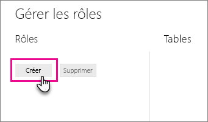
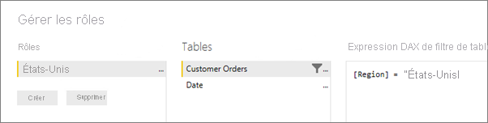
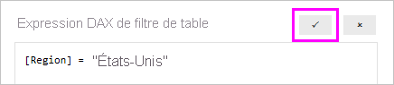

## <a name="define-roles-and-rules-in-power-bi-desktop"></a>Définir des rôles et des règles dans Power BI Desktop
Vous pouvez définir des rôles et des règles dans Power BI Desktop. Quand vous publiez sur Power BI, les définitions de rôles sont aussi publiées.

Pour définir des rôles de sécurité, effectuez les étapes suivantes.

1. Importez les données dans votre rapport Power BI Desktop ou configurez une connexion DirectQuery.
   
   > [!NOTE]
   > Vous ne pouvez pas définir de rôles dans Power BI Desktop pour les connexions actives Analysis Services. Vous devez le faire dans le modèle Analysis Services.
   > 
   > 
2. Sous l’onglet **Modélisation**, sélectionnez **Gérer les rôles**.
   
   
3. Dans la fenêtre **Gérer les rôles**, sélectionnez **Créer**.
   
   
4. Sous **Rôles**, entrez un nom pour le rôle. 
5. Sous **Tables**, sélectionnez la table à laquelle vous souhaitez appliquer une règle DAX.
6. Dans la zone **Expression DAX de filtre de table**, entrez les expressions DAX. Cette expression retourne la valeur true ou false. Par exemple : ```[Entity ID] = “Value”```.
      
   

   > [!NOTE]
   > Vous pouvez utiliser *username()* dans cette expression. N’oubliez pas que *username()* est au format *DOMAINE\nom_utilisateur* dans Power BI Desktop. Dans le service Power BI et Power BI Report Server, c’est le nom d’utilisateur principal (UPN) de l’utilisateur qui est employé. Vous pouvez également utiliser *userprincipalname()*, qui retourne systématiquement l’utilisateur au format de son nom d’utilisateur principal, *username\@contoso.com*.
   > 
   > 

7. Une fois l’expression DAX créée, cochez la case au-dessus de la zone d’expression pour valider l’expression.
      
   
   
   > [!NOTE]
   > Dans cette zone d’expression, vous utilisez des virgules pour séparer les arguments des fonctions DAX, même si vous utilisez des paramètres régionaux qui utilisent normalement des points-virgules comme séparateurs (par exemple le français ou l’allemand). 
   >
   >
   
8. Sélectionnez **Enregistrer**.

Vous ne pouvez pas attribuer d’utilisateurs à un rôle dans Power BI Desktop. Vous devez le faire dans le service Power BI. Dans Power BI Desktop, vous pouvez activer la sécurité dynamique en utilisant les fonctions DAX *username()* ou *userprincipalname()* et en configurant les relations appropriées. 

