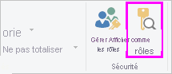
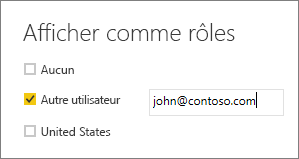

## Validation du rôle au sein de Power BI Desktop
Après avoir créé votre rôle, vous pouvez tester les résultats du rôle dans Power BI Desktop. Pour ce faire, sélectionnez **Afficher comme rôles**.

La boîte de dialogue **Afficher comme rôles** permet de modifier l’affichage de ce que vous voyez pour un rôle ou utilisateur spécifique. Vous voyez les rôles que vous avez créés.

Sélectionnez le rôle que vous avez créé, puis sélectionnez **OK** pour appliquer ce rôle à ce que vous voyez. Les rapports affichent uniquement les données pertinentes pour ce rôle.

Vous pouvez également sélectionner Autre utilisateur et indiquer un utilisateur spécifique. Il est préférable de fournir le nom d’utilisateur principal (UPN), puisque c’est ce que le service Power BI utilise. Sélectionnez **OK** pour effectuer le rendu des rapports en fonction de ce que cet utilisateur peut voir. 

> [!NOTE]
> Dans Power BI Desktop, ceci affiche des résultats différents uniquement si vous utilisez la sécurité dynamique basée sur vos expressions DAX.
> 
> 

