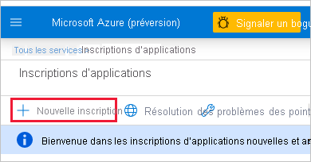

1. Connectez-vous à [Microsoft Azure](https://ms.portal.azure.com/#allservices).

2. Recherchez les **inscriptions d’applications**, puis cliquez sur le lien **Inscriptions d’applications**.

    

3. Cliquez sur **Nouvelle inscription**.

    

4. Entrez les informations obligatoires :
    * **Nom** : entrer un nom pour votre application
    * **Types de comptes pris en charge** : sélectionner les types de comptes pris en charge
    * (facultatif) **Rédiriger l’URI** : entrer un URI si nécessaire

5. Cliquez sur **S'inscrire**.

6. Une fois l’inscription terminée, l’*ID d’application* est disponible dans l’onglet **Vue d’ensemble**. Copiez et enregistrez l’*ID de l’application* pour une future utilisation.

    