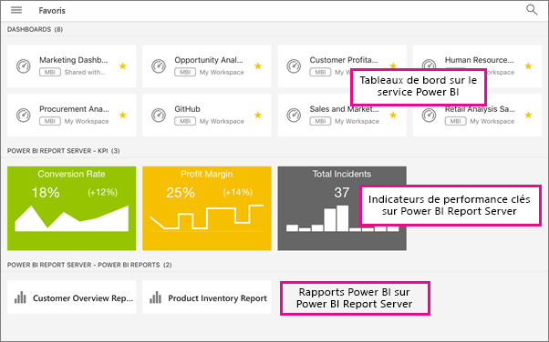

# Définir des tableaux de bord, applications et rapports locaux comme favoris dans les applications mobiles Power BI
S’applique à :

|  |  |  |  |  |
|:--- |:--- |:--- |:--- |:--- |
| iPhone |iPad |Téléphones Android |Tablettes Android |Appareils Windows 10 |

Dans la page Favoris des applications mobiles, vous voyez vos tableaux de bord et applications Power BI, ainsi que vos indicateurs de performance clés et rapports mobiles Power BI Report Server et Reporting Services favoris. Quand vous marquez un tableau de bord ou une application en tant que *favori* dans les applications mobiles Power BI, vous pouvez y accéder sur votre page Favoris du service Power BI ([https://powerbi.com](https://powerbi.com)) et de tous vos appareils mobiles. 

Vous pouvez également [marquer comme favoris des tableaux de bord et applications Power BI dans le service Power BI](service-dashboard-favorite.md). Vous pouvez ensuite les consulter sur la page Favoris dans l’application mobile.

Vous pouvez marquer des indicateurs de performance clés et rapports en tant que favoris sur un portail web Power BI Report Server ou Reporting Services, puis les afficher dans un seul dossier sur votre appareil mobile, ainsi que vos tableaux de bord Power BI favoris.

## Afficher vos tableaux de bord et applications Power BI, ainsi que vos rapports et indicateurs de performance clés locaux favoris
* Appuyez sur le menu de navigation en haut , puis sur **Favoris**.
  
  
  
  Vous pouvez voir tous vos favoris regroupés sur cette page :
  
  

## Marquer une application en tant que favorite
1. Dans la liste des applications dans l’application mobile, cliquez sur les points de suspension (...) en regard de l’application > **Favoris**.
   
    
   
    Désormais, l’application est répertoriée avec vos autres applications et tableaux de bord favoris.
   
    

## Marquer un tableau de bord en tant que favori dans des applications mobiles iOS et Windows 10
Vous pouvez marquer un tableau de bord ou une application Power BI en tant que favoris à partir de la liste des tableaux de bord ou du tableau de bord proprement dit.

* Dans la liste des tableaux de bord dans l’application mobile, appuyez sur l’étoile vide en regard du nom du tableau de bord . L’étoile devient jaune .
  
    
* Sur le tableau de bord, appuyez sur l’étoile vide dans le ruban en haut . L’étoile devient jaune .
  
    

## Maquer un tableau de bord en tant que Favori dans les applications mobiles Android
Vous pouvez ajouter un tableau de bord aux favoris à partir de la liste des tableaux de bord ou du tableau de bord lui-même.

* Dans la liste des tableaux de bord dans l’application mobile, appuyez sur les trois points verticaux (...) en regard du nom du tableau de bord, puis appuyez sur **Favoris**. Vous voyez une étoile jaune en regard du nom .
  
    
* Sur le tableau de bord, appuyez sur l’étoile vide dans le ruban en haut . L’étoile devient gris foncé .
  
    

## Marquer comme favoris des rapports et indicateurs de performance clés Power BI Report Server et Reporting Services
Vous pouvez afficher vos rapports et indicateurs de performance clés Power BI Report Server et Reporting Services favoris dans les applications mobiles Power BI, mais vous ne pouvez pas les marquer en tant que favoris dans ces applications. Vous [les marquez en tant que favoris dans le portail web](report-server/getting-around.md#tag-your-favorite-reports-and-kpis). 

## Étapes suivantes
* [Tableaux de bord favoris dans le service Power BI](service-dashboard-favorite.md) 
* Vous avez des questions ? [Essayez d’interroger la communauté Power BI](http://community.powerbi.com/)

