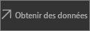

# Démarrage rapide : Explorer des tableaux de bord et des rapports dans les applications mobiles Power BI
Dans ce guide de démarrage rapide, vous allez explorer des tableaux de bord et des rapports dans les applications mobiles Power BI sur un téléphone Android. Vous pouvez également le suivre sur les autres applications mobiles. 

S’applique à :

|  |  |  |  |
|:--- |:--- |:--- |:--- |
| iPhone | iPad | Android | Windows 10 |

Un tableau de bord est un portail qui donne accès au cycle de vie et aux processus de votre entreprise. Il fournit une vue d’ensemble, un emplacement unique d’où surveiller l’état actuel des activités de l’entreprise. Les rapports constituent une vue interactive des données, avec des visuels représentant différentes observations et différents insights. 

## Conditions préalables

### S’inscrire à Power BI
Si vous n’êtes pas inscrit à Power BI, [inscrivez-vous à un essai gratuit](https://app.powerbi.com/signupredirect?pbi_source=web) avant de commencer.

### Installer l’application Power BI pour Android
[Téléchargez l’application Power BI pour Android](http://go.microsoft.com/fwlink/?LinkID=544867) sur Google Play.

Power BI fonctionne sur les appareils Android équipés du système d’exploitation Android 5.0 ou d’une version ultérieure. Pour le vérifier sur votre appareil, accédez à **Paramètres** > **À propos de l’appareil** > **Version d’Android**.

### Télécharger l’exemple Analyse de la vente au détail
La première étape de ce guide de démarrage rapide consiste à télécharger l’exemple Retail Analysis (Analyse de la vente au détail) dans le service Power BI.

1. Ouvrez le service Power BI dans votre navigateur (app.powerbi.com) et connectez-vous.

1. Sélectionnez l’icône de navigation globale pour ouvrir le volet de navigation de gauche.

    

2. Dans le volet de navigation de gauche, sélectionnez **Espaces de travail** > **Mon espace de travail**.

    

3. Dans le coin inférieur gauche, sélectionnez **Obtenir des données**.
   
    

3. Sur la page Obtenir des données, sélectionnez l’icône **Exemples**.
   
   

4. Sélectionnez **l’exemple Retail Analysis** (Analyse de la vente au détail).
 
    
 
8. Sélectionnez **Se connecter**.  
  
   
   
5. Power BI importe l’exemple, puis ajoute un tableau de bord, un rapport et un jeu de données à votre espace de travail.
   
   

Vous pouvez à présent consulter les exemples sur votre appareil Android.

## Afficher un tableau de bord sur un appareil Android
1. Sur votre appareil Android, ouvrez l’application Power BI et connectez-vous avec les informations d’identification de compte Power BI que vous avez utilisées dans le service Power BI, dans le navigateur.

1.  Appuyez sur le bouton de navigation globale .

2.  Appuyez sur **Espaces de travail** > **Mon espace de travail**.

    

3. Appuyez sur le tableau de bord Exemple Retail Analysis (Analyse de la vente au détail) pour l’ouvrir.
 
    
   
    Une notation au-dessous du nom de tableau du bord (dans ce cas, la lettre « C ») montre comment sont classées les données de ce tableau de bord. En savoir plus sur la [classification des données dans Power BI](service-data-classification.md).

    Les tableaux de bord Power BI ont une apparence un peu différente sur votre téléphone Android. Toutes les vignettes ont la même largeur et elles sont disposées verticalement.

4. Appuyez sur l’icône en étoile  dans la barre de titre pour ajouter ce tableau de bord aux favoris.

    Un favori dans l’application mobile est aussi un favori dans le service Power BI, et inversement.

4. Faites défiler la page et appuyez sur le graphique en courbes pleines « This Year’s Sales, Last Year’s Sales » (« Ventes de cette année, ventes de l’année dernière »).

    

    Il s’ouvre en mode Focus.

7. En mode Focus, appuyez sur Apr dans le graphique. Les valeurs d’avril s’affichent en haut du graphique.

    

8. Appuyez sur l’icône Rapport  dans le coin supérieur droit. Le rapport lié à cette vignette s’ouvre en mode paysage.

    

9. Appuyez sur la bulle jaune « 040 – Juniors » dans le graphique en bulles. Les valeurs associées dans les autres graphiques sont mises en surbrillance. 

    

10. Faites glisser votre doigt pour afficher la barre d’outils en bas, puis appuyez sur l’icône en forme de crayon.

    

11. Appuyez sur l’icône en forme d’émoticône dans la barre d’outils Annoter, et ajoutez des émoticônes à votre page de rapport.
 
    

12. Appuyez sur **Partager** dans le coin supérieur droit.

1. Renseignez leurs adresses e-mail et ajoutez un message si vous le souhaitez.  

    

    Vous pouvez partager cet instantané avec d’autres personnes appartenant ou non à votre organisation. Celles qui font partie de votre organisation et ont leur propre compte Power BI pourront également ouvrir le rapport de l’exemple Retail Analysis (Analyse de vente au détail).

## Nettoyer les ressources

Maintenant que vous avez suivi ce guide de démarrage rapide, vous pouvez si vous le souhaitez supprimer le rapport, le jeu de données et le tableau de bord de l’exemple Retail Analysis (Analyse des ventes au détail).

1. Ouvrez le service Power BI (app.powerbi.com) et connectez-vous.

2. Dans le volet de navigation de gauche, sélectionnez **Espaces de travail** > **Mon espace de travail**.

    Remarquez l’étoile jaune indiquant que c’est un favori.

3. Sous l’onglet **Tableaux de bord**, sélectionnez l’icône **Supprimer** de la corbeille à côté du tableau de bord Retail Analysis (Analyse de la vente au détail).

    

4. Sélectionnez l’onglet **Rapports** et procédez de la même façon pour le rapport Retail Analysis (Analyse de la vente au détail).

5. Sélectionnez l’onglet **Jeux de données** et procédez de la même façon pour le jeu de données Retail Analysis (Analyse de la vente au détail).

## Étapes suivantes

Dans ce guide de démarrage rapide, vous avez exploré un exemple de tableau de bord et de rapport sur votre appareil Android. Découvrez plus en détail comment travailler avec le service Power BI. 

> [!div class="nextstepaction"]
> [Démarrage rapide : Découvrir le service Power BI](service-the-new-power-bi-experience.md)

