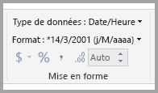
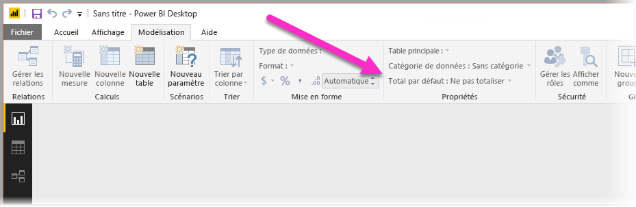
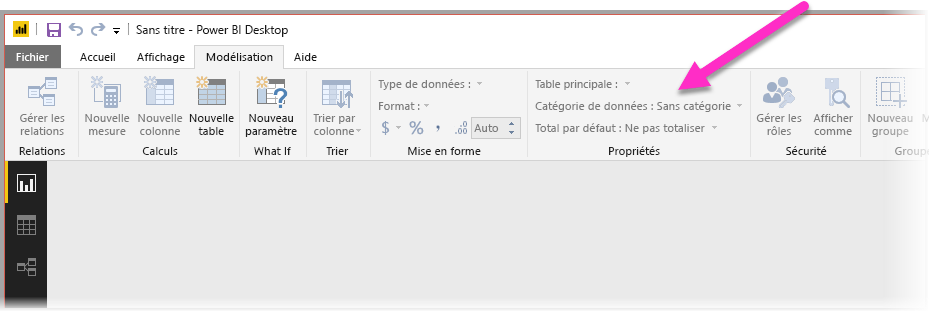
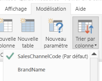
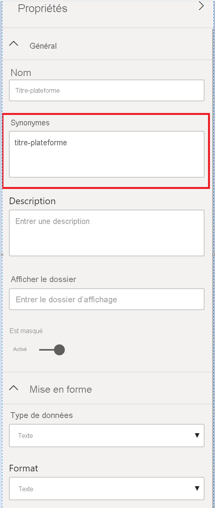

# Bonnes pratiques pour optimiser Questions et réponses dans Power BI
Utiliser des phrases courantes et un langage naturel pour poser des questions sur vos données, c’est fort. Et quand vos données y répondent, c’est encore plus efficace. C’est ce que vous permet de faire Questions et réponses dans Power BI.

Pour que l’application Q&A interprète correctement les nombreuses questions auxquelles elle peut répondre, elle doit émettre des hypothèses sur le modèle. Si la structure de votre modèle ne correspond à aucune de ces hypothèses, vous devez ajuster votre modèle. Ces ajustements pour Q&A sont les mêmes optimisations recommandées pour tous les modèles dans Power BI, indépendamment de Q&A.

Dans les sections suivantes, nous allons décrire comment ajuster votre modèle pour qu’il fonctionne correctement avec Q&A dans Power BI.

## Ajustements automatiques effectués par Questions et réponses

### Tables de mesures

Dans les versions précédentes de Questions et réponses, les tables de mesures déroutaient Questions et réponses, car la table sous-jacente était déconnectée. Questions et réponses fonctionne maintenant très bien avec les tables de mesures.

### Conflits entre les noms de tables et les noms de colonnes

Dans les versions précédentes de Questions et réponses, si une table et une colonne avaient le même nom, la table avait la priorité. Ce problème a été résolu et vous n’avez plus besoin de vous en préoccuper dans vos modèles.

## Étapes manuelles pour améliorer Questions et réponses

### Utilisez les nouveaux outils Questions et réponses pour corriger vos questions

Avec les outils Questions et réponses, vous pouvez enseigner vos principaux termes métier à Questions et réponses et corriger les questions posées par vos utilisateurs. Parfois, certaines questions ne peuvent pas être résolues, car les données sont mises en forme de manière incorrecte ou des données sont manquantes. Dans ce cas, lisez les sections ci-dessous qui vous aideront à optimiser les questions. Découvrez plus en détail les [outils Questions et réponses](q-and-a-tooling-intro.md).

## Ajouter des relations manquantes

Si des relations entre les tables sont manquantes dans votre modèle, ni les rapports Power BI ni Questions et réponses ne peuvent interpréter la façon de joindre ces tables. Les relations sont la pierre angulaire d’un bon modèle. Par exemple, vous ne pouvez pas demander le « total des ventes pour les clients de Seattle » s’il n’existe pas de relation entre la table *commandes* et la table *clients*. Les images suivantes montrent un modèle à modifier et un autre prêt à être utilisé avec Questions et réponses. 

**Modification nécessaire**

Dans la première image, il n’existe aucune relation entre les tables Customers (Clients), Sales (Ventes) et Products (Produits).

**Prêt pour Q&A**

Dans la première image, des relations sont définies entre les tables.

## Renommer les tables et les colonnes

Pour Q&A, le choix des tables et des colonnes est important. Par exemple, imaginons que vous avez une table nommée *CustomerSummary* qui contient une liste de vos clients. Vous devriez poser des questions comme « Liste des résumés clients à Chicago » plutôt que « Liste des clients à Chicago ». 

Questions et réponses est capable de reconnaître des mots élémentaires et des pluriels, mais part du principe que les noms de vos tables et colonnes reflètent précisément leur contenu.

Prenons un autre exemple. Imaginons que vous avez une table nommée *Headcount* qui contient les noms et prénoms, et le nombre des employés. Vous avez une autre table nommée *Employees* qui contient le nombre des employés, le nombre de tâches et les dates de début. Les utilisateurs familiarisés avec le modèle peuvent comprendre cette structure. Une autre personne qui demande « compter les employés » va obtenir le nombre de lignes à partir de la table « Employees ». Ce résultat ne correspond probablement pas à ce qu’elle avait en tête, car il s’agit du nombre de tous les postes que les employés ont occupés. Il serait préférable de renommer ces tables de manière à refléter réellement ce qu’elles contiennent.

**Modification nécessaire**

Des noms de tables comme *StoreInfo* (InfosMagasin) et *Product List* (Liste des produits) nécessitent des modifications.

**Prêt pour Q&A**

Des tables nommées *Store* (Magasin) et *Products* (Produits) fonctionnent mieux.

## Résoudre les types de données incorrects

Les données importées peuvent présenter des types de données incorrects. En particulier, les colonnes contenant des *dates* et des *nombres* qui sont importées en tant que *chaînes* ne sont pas interprétées par Q&A comme des dates et des nombres. Veillez à sélectionner le type de données approprié dans votre modèle Power BI.

## Définir Ne pas synthétiser pour les colonnes Année et Identificateur

Power BI agrège par défaut les colonnes numériques de façon radicale. Par conséquent, des questions comme « total des ventes par année » peuvent aboutir à un total général des ventes associé à un total général des années. Si vous souhaitez empêcher ce comportement de Power BI sur des colonnes spécifiques, définissez la propriété **Total par défaut** pour la colonne sur **Ne pas totaliser**. Prêtez une attention particulière aux colonnes **année**, **mois**, **jour** et **ID**, qui posent le plus souvent problème. Pour les autres colonnes qui ne craignent pas d’être totalisées, telles que *âge*, il peut également être préférable de définir **Total par défaut** sur **Ne pas totaliser** ou sur **Moyenne**. Ce paramètre est disponible dans l’onglet **Modélisation**.

## Choisir une catégorie de données pour chaque colonne contenant des dates et des indications géographiques

La **catégorie de données** apporte des informations sémantiques supplémentaires sur le contenu d’une colonne au-delà de son type de données. Par exemple, vous pouvez marquer une colonne d’entiers en tant que Code postal, une colonne de chaînes en tant que Ville, Pays, Région, etc. Questions et réponses utilise ces informations de deux manières importantes : Pour la sélection de visualisation et les tendances de langage.

Premièrement, Q&A utilise la **catégorie de données** pour guider les choix en matière de présentation visuelle. Par exemple, l’application reconnaît que les colonnes contenant une **catégorie de données** « date » ou « heure » sont généralement appropriées pour l’axe horizontal d’un graphique en courbes ou pour l’axe de lecture d’un graphique en bulles. L’application estime également que les résultats contenant des colonnes avec des **catégories de données** d’indication géographique se prêtent parfaitement à un affichage sur une carte.

Deuxièmement, Q&A émet des hypothèses sur la façon dont les utilisateurs peuvent évoquer les colonnes de date et d’indication géographique, pour pouvoir comprendre certains types de questions. Par exemple, le mot « quand » dans « Quand John Smith a-t-il été embauché ? » renverra certainement à une colonne contenant des dates, et le mot « Orange » dans « Nombre de clients à Orange » sera plus susceptible de désigner une ville qu’une couleur.

## Choisir Trier par colonne pour les colonnes appropriées

La propriété **Trier par colonne** permet d’effectuer automatiquement le tri d’une colonne en fonction d’une autre colonne. Par exemple, si vous demandez « trier les clients par taille de T-shirt », vous voulez sans doute trier votre colonne « Taille de T-shirt » par numéro de taille (XS, S, M, L, XL) plutôt que par ordre alphabétique (L, M, S, XL, XS).

## Normaliser votre modèle

Rassurez-vous, nous ne vous conseillons pas de reformer entièrement votre modèle. Toutefois, certaines structures sont si compliquées que Q&A ne les traite pas correctement. Si vous effectuez une normalisation simple de la structure de votre modèle, la facilité d’utilisation des rapports Power BI augmentera de manière significative, de même que la justesse des résultats de Questions et réponses.

Suivez cette règle générale : chaque « objet » unique dont parle l’utilisateur doit être représenté par un seul objet de modèle (table ou colonne). Ainsi, si vos utilisateurs parlent de clients, vous devez avoir un objet *client*. S’ils parlent de ventes, vous devez avoir un objet *ventes*. Ça paraît simple, non ? La simplicité du processus dépend de la forme de vos données de départ. Des fonctionnalités enrichies de mise en forme des données sont disponibles dans l’**Éditeur de requête**, mais la plupart des transformations simples peuvent être effectuées à l’aide de calculs dans le modèle Power BI.

Les sections suivantes présentent des transformations courantes que vous pourriez être amené à effectuer.

### Créer de nouvelles tables pour les entités à plusieurs colonnes

Si vous avez plusieurs colonnes qui forment une seule unité distincte au sein d’une table plus grande, celles-ci doivent être fractionnées en tables propres. Par exemple, supposons que vous avez une colonne Nom du contact, Titre du contact et Téléphone du contact dans votre table *Entreprises*. Une meilleure conception consisterait à avoir une table *Contacts* distincte qui contiendrait le nom, le titre et le téléphone, ainsi qu’un lien pour revenir à la table *Entreprises*. Cela simplifie l’interrogation à propos des contacts, indépendamment des questions concernant les sociétés qu’ils représentent, et améliore la flexibilité de l’affichage.

**Modification nécessaire**

**Prêt pour Q&A**

### Utilisez des valeurs croisées dynamiques pour éliminer les conteneurs de propriétés

Si votre modèle possède des *conteneurs de propriétés*, ceux-ci doivent être restructurés de manière à posséder une seule colonne par propriété. Les conteneurs de propriétés, qui sont utiles pour gérer un grand nombre de propriétés, présentent trop de limitations inhérentes que ni les rapports Power BI ni Q&A ne peuvent contourner.

Par exemple, prenons une table *CustomerDemographics* (DémographieClients) avec les colonnes CustomerID (IDClient), Property (Propriété) et Value (Valeur), dans laquelle chaque ligne représente une propriété différente du client (âge, état civil, ville, etc.). Le fait d’avoir plusieurs significations pour la colonne Value, qui dépendent du contenu de la colonne Property, empêche Q&A d’interpréter la plupart des requêtes qui y font référence. Une question simple telle que « montrer l’âge de chaque client » est susceptible de marcher, car elle peut être interprétée comme « montrer les clients et les données démographiques des clients où la propriété est l’âge ». Cependant, la structure du modèle ne prend pas en charge les questions un peu plus complexes telles que « âge moyen des clients à Chicago ». Même si les utilisateurs qui créent directement des rapports Power BI peuvent parfois trouver des astuces pour obtenir les données qu’ils recherchent, Q&A fonctionne seulement quand chaque colonne n’a qu’une seule signification.

**Modification nécessaire**

**Prêt pour Q&A**

### Unir pour éliminer le partitionnement

Si vous avez partitionné vos données entre plusieurs tables ou réutilisé des valeurs dans différentes colonnes, certaines opérations courantes sont difficiles voire impossibles à effectuer pour vos utilisateurs. Prenons tout d’abord un partitionnement de table typique : une table *Sales2000-2010* et une table *Sales2011-2020*. Si vos rapports importants sont tous limités à une décennie spécifique, vous pouvez les laisser tels quels pour les rapports Power BI. Cependant, la flexibilité de Questions et réponses amène vos utilisateurs à attendre des réponses à des questions telles que « total des ventes par année ». Pour que cette requête fonctionne, vous devez réunir les données en une seule table de modèle Power BI.

De même, prenons un colonne de valeur croisée dynamique typique : une table *BookTour* contenant les colonnes Author, Book, City1, City2 et City3. Avec une telle structure, même une question simple telle que « compter les livres par ville » ne peut pas être interprétée correctement. Pour que cette requête fonctionne, créez une table *BookTourCities* séparée, qui réunit les valeurs de villes en une seule colonne.

**Modification nécessaire**

**Prêt pour Q&A**

### Fractionner les colonnes mises en forme

Si la source à partir de laquelle vous importez vos données contient des colonnes mises en forme, les rapports Power BI (et Questions et réponses) ne peuvent pas atteindre le contenu des colonnes pour l’analyser. Ainsi, si vous avez une colonne **Full Address** qui contient l’adresse, la ville et le pays, vous devez également la fractionner en plusieurs colonnes Adresse, Ville et Pays pour que vos utilisateurs puissent les interroger de manière individuelle.

**Modification nécessaire**

**Prêt pour Q&A**

De même, si vous avez une colonne contenant des noms complets, ajoutez des colonnes **Prénom** et **Nom**, au cas où un utilisateur souhaiterait poser une question contenant seulement une partie du nom. 

### Créer de nouvelles tables pour les colonnes à plusieurs valeurs

Dans une situation similaire, si la source à partir de laquelle vous importez vos données contient des colonnes à valeurs multiples, les rapports Power BI (et Questions et réponses) ne peuvent pas atteindre le contenu des colonnes pour l’analyser. Ainsi, si vous avez une colonne Compositeur qui contient les noms de plusieurs compositeurs d’une chanson, vous devez la diviser en plusieurs lignes dans une table *Compositeurs* distincte.

**Modification nécessaire**

**Prêt pour Q&A**

### Dénormaliser pour éliminer les relations inactives

La règle de toujours préférer la normalisation accepte une seule exception : lorsqu’il existe plusieurs façons de passer d’une table à l’autre. Par exemple, si vous avez une table *Flights* avec les colonnes SourceCityID et DestinationCityID, chacune étant reliée à la table *Cities*. L’une de ces relations doit être marquée comme inactive. Étant donné que Q&A ne peut utiliser que des relations actives, vous ne pouvez pas poser de questions sur le point de départ ou la destination, selon ce que vous choisissez. Si vous dénormalisez les colonnes contenant le nom des villes dans la table *Flights*, vous pouvez poser des questions telles que : « Liste des vols pour demain au départ de Seattle et à destination de San Francisco ».

**Modification nécessaire**

**Prêt pour Q&A**

### Ajouter des synonymes aux tables et aux colonnes

Cette étape s’applique spécifiquement à Q&A (et non aux rapports Power BI en général). Les utilisateurs ont souvent recours à différents termes pour parler de la même chose, par exemple total des ventes, ventes nettes, total net des ventes. Vous pouvez ajouter ces synonymes aux tables et aux colonnes dans le modèle Power BI. 

Cette étape peut être importante. Même avec des noms de table et de colonne simples, les utilisateurs de Questions et réponses posent des questions à l’aide d’un vocabulaire spontané. Ils ne choisissent pas dans une liste prédéfinie de colonnes. Plus vous ajoutez de synonymes justes, meilleure en sera l’expérience de vos utilisateurs avec votre rapport. Pour ajouter des synonymes, dans Power BI Desktop, accédez à la vue Modèle, sélectionnez l’onglet Modélisation et sélectionnez un champ ou une table. Le volet Propriétés affiche la zone **Synonymes**, dans laquelle vous pouvez ajouter des synonymes.

 Soyez prudent lorsque vous ajoutez des synonymes. L’ajout d’un même synonyme à plusieurs colonnes ou tables introduit une ambiguïté. Questions et réponses utilise un contexte dès que possible pour choisir entre des synonymes ambigus, mais toutes les questions ne fournissent pas suffisamment de contexte. Par exemple, lorsque votre utilisateur demande de « dénombrer les clients », si vous disposez de trois choses avec le synonyme « client » dans votre modèle, les utilisateurs peuvent ne pas obtenir la réponse qu’ils attendent. Dans ce cas, assurez-vous que le synonyme primaire est unique, car c’est lui qui est utilisé dans la reformulation. L’application peut signaler l’ambiguïté à l’utilisateur (par exemple, la reformulation de « montrer le nombre d’enregistrements clients archivés ») et lui suggérer de reformuler sa question.

## Étapes suivantes

[Présentation de Questions et réponses dans Power BI](q-and-a-intro.md)
