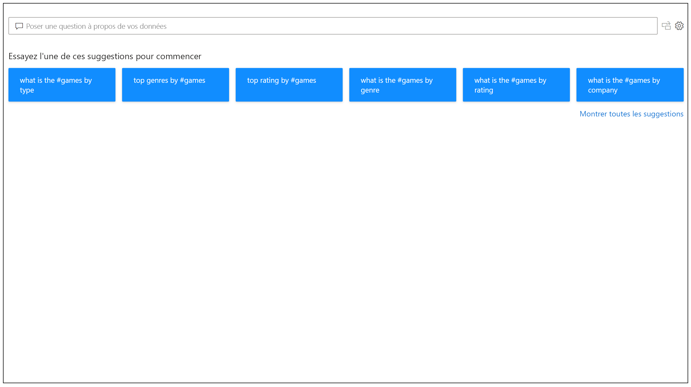
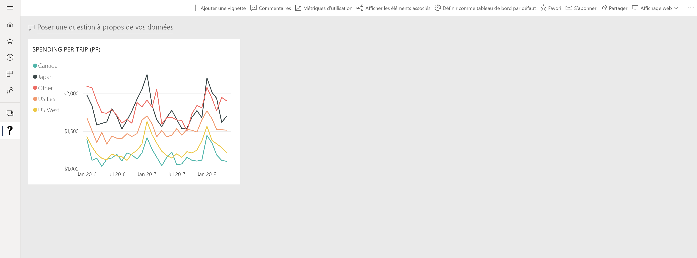

# Présentation de Questions et réponses dans Power BI

Parfois, le moyen le plus rapide d’obtenir une réponse à partir de vos données consiste à effectuer une recherche en langage naturel dans vos données. La fonctionnalité Questions et réponses de Power BI vous permet d’explorer vos données dans vos propres termes en langage naturel. La fonctionnalité Questions et réponses est interactive, voire même divertissante. Souvent, une question mène à d’autres questions, car les visualisations révèlent des pistes intéressantes à suivre. Les questions ne sont qu’un début. Explorez vos données, affinez ou développez vos questions, découvrez de nouvelles informations, ciblez des détails ou effectuez un zoom arrière pour élargir la vue. L’expérience, qui s’appuie sur un stockage en mémoire, est interactive et rapide. 

La fonctionnalité Questions et réponses de Power BI est gratuite et à la disposition de tous les utilisateurs. Dans Power BI Desktop, les concepteurs de rapports peuvent utiliser Questions et réponses pour explorer les données et créer des visualisations. Dans le service Power BI, tout le monde peut explorer ses données avec Questions et réponses. Nos applications mobiles prennent aussi en charge Questions et réponses, avec l’assistant virtuel Questions et réponses dans iOS et le visuel Questions et réponses sur les appareils Android. Si vous êtes autorisé à modifier un tableau de bord ou un rapport, vous pouvez également épingler vos résultats de Questions et réponses.

## Utilisation de Questions et réponses

Avant même que vous commenciez à taper votre question, Q&R affiche dans un nouvel écran des suggestions de formulation de votre question. Commencez avec une des questions suggérées ou tapez vos propres questions. La fonctionnalité Questions et réponses prend en charge un large éventail de questions, y compris mais sans s’y limiter :

- **Poser des questions naturelles** Quelle vente a le revenu le plus élevé ?
- **Utiliser le filtrage de date relative** Afficher les ventes de l’année dernière
- **Retourner uniquement les N premiers** Top 10 des produits les plus vendus
- **Fournir un filtre** Afficher les ventes aux États-Unis
- **Fournir des conditions complexes** Afficher les ventes des produits de catégorie 1 ou 2
- **Retourner un visuel spécifique** Afficher les ventes par produit sous forme de graphique à secteurs
- **Utiliser des agrégations complexes** Afficher les ventes médianes par produit
- **Trier les résultats** Afficher le top 10 des pays selon les ventes dans l’ordre du code de pays
- **Comparer les données** Afficher la date avec le total des ventes par rapport au coût total
- **Afficher les tendances** Afficher les ventes dans le temps

### Autocomplétion

À mesure que vous tapez votre question, la fonctionnalité Questions et réponses de Power BI affiche des suggestions pertinentes et contextuelles pour vous aider à produire rapidement du langage naturel. Pendant la saisie, vous recevez des commentaires et des résultats immédiats. L’expérience est similaire à la saisie dans un moteur de recherche.

### Traits de soulignement rouges/bleus/orange

La fonctionnalité Questions et réponses affiche des mots soulignés pour vous aider à identifier les mots que le système comprend ou ne reconnaît pas. Un trait de soulignement continu bleu indique que le système a correctement mis en correspondance le mot avec un champ ou une valeur dans le modèle de données. L’exemple ci-dessous montre que la fonctionnalité Questions et réponses a reconnu le mot *EU Sales*.

 Un soulignement orange indique que le ou les mots sont catégorisés comme étant de *faible confiance*. Si vous tapez un mot vague ou ambigu, le champ est souligné en orange. Le mot « Sales » (Ventes) en est un exemple. Plusieurs champs peuvent contenir le mot « Sales », si bien que le système utilise un trait de soulignement orange pour vous inviter à choisir le champ que vous souhaitiez. La saisie du mot « area » est un autre exemple à confiance faible, mais la colonne correspondante est « region ». Power BI Questions et réponses reconnaît les mots qui signifient la même chose, grâce à l’intégration à Bing et à Office, et à l’interprétation des renommages dans un rapport en tant que suggestions potentielles. Questions et réponses souligne le mot en orange pour vous indiquer qu’il ne s’agit pas d’une correspondance directe.

Un trait de soulignement rouge signifie que Questions et réponses n’a pas reconnu le mot du tout. Vous pouvez rencontrer ce problème en utilisant un terme spécifique à un domaine qui n’est mentionné nulle part dans les données, ou si les champs de données sont incorrectement nommés. L’utilisation du mot « Costs » alors que le mot ne figure pas dans les données en est un exemple. Le mot est dans le dictionnaire anglais, mais Questions et réponses marque ce terme avec un trait de soulignement rouge pour indiquer qu’il n’a pas trouvé ce terme en ce qui concerne les données.

> [!NOTE]
> Vous pouvez personnaliser les couleurs de soulignement bleue/rouge/orange dans le volet **Visual formatting** (Mise en forme visuelle) de Questions et réponses. En outre, l’article [Enseigner à Questions et réponses](q-and-a-tooling-teach-q-and-a.md) décrit les *outils Questions et réponses* qui vous permettent de définir les termes que Questions et réponses n’a pas reconnus.

### Résultats de visualisation

Au fur et à mesure que vous tapez votre question, Questions et réponses tente d’interpréter et de visualiser instantanément la réponse. Dans le cadre des dernières mises à jour, Questions et réponses tente à présent d’interpréter la question et de représenter automatiquement les champs sur les axes appropriés. Par exemple, si vous tapez « Sales by year » (Ventes par année), Questions et réponses détecte que « year » (année) est un champ de date et place toujours en priorité ce champ sur l’axe des X. Si vous souhaitez modifier le type de visualisation, tapez « as *type de graphique* » après la question. Questions et réponses prend actuellement en charge les types de visualisations suivants :

- Graphique en courbes
- Graphique à barres
- Matrice
- Table
- Carte
- Zone
- Graphique en secteurs
- Graphique à nuages de points/à bulles
 

## Ajouter Questions et réponses à un rapport

Vous pouvez ajouter Questions et réponses à un rapport dans Power BI Desktop ou dans le service Power BI de deux façons différentes :

- Ajoutez un visuel Questions et réponses.
- Ajoutez un bouton Questions et réponses.

Pour ajouter le visuel Questions et réponses à un rapport, sélectionnez la nouvelle icône **Questions et réponses** et sélectionnez le nouveau visuel Questions et réponses dans le volet Visualisation. Vous pouvez également double-cliquer n’importe où sur le canevas du rapport pour insérer le visuel Questions et réponses.

Pour ajouter un bouton, dans le ruban **Accueil**, sélectionnez **Boutons** > **Questions et réponses**. Vous pouvez entièrement personnaliser l’image du bouton Questions et réponses.

> [!NOTE]
> Quand vous démarrez Questions et réponses avec ce bouton, il utilise encore l’ancienne fonctionnalité Questions et réponses. Les versions ultérieures de Power BI seront modifiées.

## Utiliser Questions et réponses pour les tableaux de bord

Par défaut, Questions et réponses est disponible en haut des tableaux de bord. Pour utiliser Questions et réponses, tapez dans la zone **Poser une question sur vos données**.

## Étapes suivantes

Vous pouvez intégrer le langage naturel dans vos rapports de plusieurs façons. Pour plus d’informations, consultez les articles suivants :

* [Visuel de Questions et réponses](../visuals/power-bi-visualization-q-and-a.md)
* [Bonnes pratiques pour Questions et réponses](q-and-a-best-practices.md)
