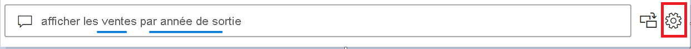

# Présentation des outils Questions et réponses pour entraîner Questions et réponses Power BI (préversion)

Avec les *outils* Questions et réponses Power BI, vous pouvez améliorer l’expérience de vos utilisateurs en matière de langage naturel. En tant que concepteur ou administrateur, vous interagissez avec le moteur de langage naturel et apportez des améliorations dans trois domaines : 

- Vous examinez les questions que vos utilisateurs ont posées.
- Vous enseignez à Questions et réponses à comprendre les questions.
- Vous gérez les termes que vous avez enseignés à Questions et réponses.

En plus de ces fonctionnalités d’outils dédiées, l’onglet **Modélisation** dans Power BI Desktop offre plus d’options :  

- Synonymes
- Étiquettes de ligne
- Masquer dans Questions et réponses
- Configuration du schéma linguistique (avancé)

## Bien démarrer avec les outils Questions et réponses

Les outils Questions et réponses sont disponibles uniquement dans Power BI Desktop et ne prennent actuellement en charge que le mode d’importation.

1. Ouvrez Power BI Desktop et utilisez Questions et réponses pour créer un visuel. 
2. Dans l’angle du visuel, sélectionnez l’icône d’engrenage. 

    

    La page Mise en route s’ouvre.  

    

### Passer en revue les questions

Sélectionnez **Passer en revue les questions** pour voir la liste des jeux de données utilisés dans le service Power BI pour votre locataire. La page **Passer en revue les questions** affiche également le propriétaire, l’espace de travail et la date de dernière actualisation du jeu de données. À partir de là, vous pouvez sélectionner un jeu de données et voir les questions posées par les utilisateurs. Les données affichent également les mots qui n’ont pas été reconnus. Toutes les données affichées ici correspondent aux 28 derniers jours.

### Entraîner Questions et réponses

La section **Enseigner à Questions et réponses** vous permet d’entraîner Questions et réponses à reconnaître des mots. Pour commencer, tapez une question contenant un ou plusieurs mots que Questions et réponses ne reconnaît pas. Questions et réponses vous invite à fournir la définition de ce terme. Entrez un filtre ou un nom de champ correspondant à ce que ce mot représente. Questions et réponses réinterprète ensuite la question d’origine. Si vous êtes satisfait des résultats, vous pouvez enregistrer votre entrée. Pour en savoir plus, consultez [Enseigner à Questions et réponses](q-and-a-tooling-teach-q-and-a.md)

### Gérer les termes

Tout ce que vous avez enregistré dans la section Enseigner à Questions et réponses apparaît ici pour vous permettre de vérifier ou de supprimer les termes que vous avez définis. Actuellement, vous ne pouvez pas modifier une définition existante. Ainsi, pour redéfinir un terme, vous devez supprimer et recréer ce terme.

### Suggérer des questions

Si vous n’avez pas effectué de configuration, le visuel Questions et réponses suggère plusieurs questions pour commencer. Ces questions sont générées automatiquement en fonction de votre modèle de données. Dans **Suggérer des questions**, vous pouvez remplacer ces questions générées automatiquement par vos propres questions. 

Pour commencer, tapez la question que vous souhaitez ajouter dans la zone de texte. La section Aperçu montre le résultat obtenu dans le visuel Questions et réponses. 

:::image type="content" source="media/q-and-a-tooling-intro/power-bi-qna-suggest-questions.png" alt-text="Suggérer des questions Questions et réponses":::
 
Sélectionnez le bouton **Ajouter** pour ajouter cette question à **Vos suggestions de questions**. Chaque question supplémentaire est ajoutée à la fin de cette liste. Les questions s’affichent dans le visuel Questions et réponses dans le même ordre que dans cette liste. 

:::image type="content" source="media/q-and-a-tooling-intro/power-bi-qna-save-suggest-questions.png" alt-text="Enregistrer les suggestions de questions":::
 
Pensez à sélectionner **Enregistrer** pour afficher votre liste de suggestions de questions dans le visuel Questions et réponses. 

## Autres paramètres de Questions et réponses

### Synonymes en vrac

L’onglet **Modélisation** de Power BI Desktop offre d’autres options pour améliorer l’expérience Questions et réponses. 

1. Dans Power BI Desktop, sélectionnez la vue Modélisation.

2. Sélectionnez un champ ou une table pour afficher le volet **Propriétés**.  Ce volet s’affiche sur le côté droit de la zone de dessin et liste plusieurs actions Questions et réponses. L’une de ces options est **Synonymes**. Dans la zone **Synonymes**, vous pouvez définir rapidement des alternatives pour la table ou le champ que vous sélectionnez. Vous pouvez également définir des synonymes dans la section **Enseigner à Questions et réponses** de la boîte de dialogue Outils, mais il est souvent plus rapide de définir des synonymes ici pour un grand nombre de champs dans une table.

    

3. Pour définir plusieurs synonymes pour un même champ, utilisez des virgules pour délimiter le synonyme suivant.

### Masquer dans Questions et réponses

Vous pouvez également masquer des champs et des tables pour qu’ils n’apparaissent pas dans les résultats de Questions et réponses. 

1. Dans Power BI Desktop, sélectionnez la vue Modélisation.

2. Sélectionnez un champ ou une table pour afficher le volet **Propriétés** et définissez **Est masqué** sur **Activé**.

    Questions et réponses respecte ce paramètre et garantit que ce champ ne sera pas reconnu. Par exemple, vous souhaitez peut-être masquer les champs d’ID et les clés étrangères pour éviter des champs en double inutiles portant le même nom. Même si vous masquez ce champ, vous pouvez encore l’utiliser dans Power BI Desktop dans des visuels en dehors de Questions et réponses.

### Définir une étiquette de ligne

Une étiquette de ligne vous permet de définir la colonne (ou le *champ*) qui identifie le mieux une ligne individuelle dans une table. Par exemple, pour une table nommée « Client », l’étiquette de ligne est généralement « Nom d’affichage ». Le fait de fournir ces métadonnées supplémentaires permet à Questions et réponses de tracer un visuel plus utile quand les utilisateurs tapent « Afficher les ventes par client ». Au lieu de traiter « client » comme une table, il peut utiliser « Nom d’affichage » et afficher un graphique à barres indiquant les ventes de chaque client. Vous pouvez uniquement définir l’étiquette de ligne dans la vue Modélisation. 

1. Dans Power BI Desktop, sélectionnez la vue Modélisation.

2. Sélectionnez une table pour afficher le volet **Propriétés**.

3. Dans la zone **Étiquette de ligne**, sélectionnez un champ.

## Configurer le schéma linguistique (avancé)

Dans Power BI, vous pouvez entraîner et améliorer complètement le moteur de langage naturel au sein de Questions et réponses, y compris modifier le scoring et la pondération des résultats de langage naturel sous-jacents. Pour savoir comment procéder, consultez [Modifier le schéma linguistique de la fonctionnalité Questions et réponses et ajouter des formulations](q-and-a-tooling-advanced.md).

## Étapes suivantes

Il existe diverses bonnes pratiques permettant d’améliorer le moteur de langage naturel. Pour plus d’informations, consultez [Meilleures pratiques de Questions et réponses](q-and-a-best-practices.md).
