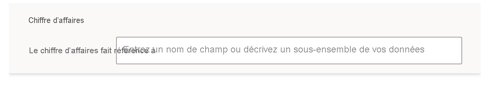
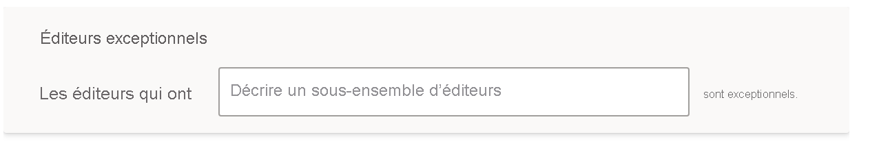

# Enseigner à Questions et réponses dans Power BI à comprendre les questions et les termes

Dans la section **Enseigner à Questions et réponses** de la configuration de Questions et réponses, vous entraînez Questions et réponses à comprendre les questions et termes en langage naturel qui n’ont pas été reconnus. Pour commencer, vous soumettez une question contenant un ou plusieurs mots que Questions et réponses n’a pas reconnus. Questions et réponses vous invite alors à définir ce terme. Vous entrez un filtre ou un nom de champ correspondant à ce que ce mot représente. Questions et réponses réinterprète ensuite la question d’origine. Si vous êtes satisfait des résultats, vous les enregistrez.

> [!NOTE]
> La fonctionnalité Enseigner à Questions et réponses prend en charge uniquement le mode Importation. Elle ne prend pas non plus encore en charge la connexion à une source de données locale ou Azure Analysis Services. Cette limitation doit être supprimée dans les versions ultérieures de Power BI.

## Commencer à enseigner à Questions et réponses

1. Dans Power BI Desktop, dans le ruban **Modélisation**, sélectionnez **Configuration de Questions et réponses** > **Enseigner à Questions et réponses**.

    

2. Tapez une phrase contenant un terme que Questions et réponses ne reconnaît pas et sélectionnez **Soumettre**.

3. Sélectionnez le mot souligné en rouge. 

    Questions et réponses fournit des suggestions et vous invite à fournir la définition correcte du terme. 
    
3. Sous **Définir les termes que Questions et réponses ne comprend pas**, fournissez une définition.

    

4. Sélectionnez **Enregistrer** pour afficher un aperçu du visuel mis à jour.

5. Entrez la question suivante ou sélectionnez **X** pour fermer.

Les consommateurs de votre rapport verront cette modification seulement quand vous aurez republié le rapport dans le service.

## Définir des substantifs et des adjectifs

Vous pouvez enseigner à Questions et réponses deux types de termes :

- Substantifs
- Adjectifs

### Définir un synonyme d’un substantif

Lorsque vous travaillez sur des données, vous pouvez souvent référencer des noms de champs par d’autres noms. Le champ « Ventes » en est un exemple. De nombreux mots ou expressions peuvent faire référence aux ventes, par exemple « chiffre d’affaires ». Si une colonne est nommée « Ventes » et que les consommateurs du rapport tapent « chiffre d’affaires », Questions et réponses risque de ne pas sélectionner la colonne appropriée pour répondre à la question. Dans ce cas, vous pouvez indiquer à Questions et réponses que « Ventes » et « Chiffre d’affaires » font référence à la même chose.

Grâce aux connaissances de Microsoft Office, Questions et réponses détecte automatiquement qu’un mot non reconnu est un substantif. Si Questions et réponses détecte un substantif, il vous sollicite de la façon suivante :

- <your term> **fait référence à** 

Vous remplissez la zone avec le terme provenant de vos données.

Si vous fournissez autre chose qu’un champ du modèle de données, vous risquez d’obtenir des résultats indésirables.

### Définir une condition de filtre adjectivale

Parfois, il se peut que vous souhaitiez définir des termes qui agissent comme une condition sur les données sous-jacentes. L’exemple « Éditeurs géniaux » illustre cela. Le terme « géniaux » peut être une condition permettant de sélectionner uniquement les éditeurs qui ont publié un nombre X de produits. Questions et réponses tente de détecter les adjectifs, en présentant une autre invite :

- <field name> **qui ont**  

Vous remplissez la zone avec la condition.

Voici quelques exemples de conditions que vous pouvez définir :

- Pays égal à EUA
- Pays différent de EUA
- Produits > 100
- Produits supérieur à 100
- Produits = 100
- Produits égal à 100
- Produits < 100
- Produits inférieur à 100

Dans ces exemples, « Produits » peut être soit un nom de colonne, soit une mesure. 

Vous pouvez également spécifier une agrégation dans l’expression Questions et réponses proprement dite. Par exemple, si les « produits populaires » sont des produits dont au moins 100 unités ont été vendues, vous pouvez définir les produits pour lesquels « somme des unités vendues > 100 » comme étant populaires.  

:::image type="content" source="media/q-and-a-tooling-teach-q-and-a/power-bi-qna-popular-products.png" alt-text="Définition de « produits populaires »":::

Vous ne pouvez définir qu’une condition unique dans les outils. Pour définir des conditions plus complexes, créez une colonne ou une mesure calculée avec DAX, puis une condition unique pour cette colonne ou cette mesure avec la section des outils.

## Gérer les termes

Une fois que vous avez fourni des définitions, vous pouvez revenir en arrière pour voir toutes les corrections que vous avez apportées et les modifier ou les supprimer. 

1. Dans **Configuration de Questions et réponses**, accédez à la section **Gérer les termes**.

2. Supprimez tous les termes que vous ne voulez plus. Actuellement, vous ne pouvez pas modifier les termes. Pour redéfinir un terme, supprimez-le et définissez-le.

    

## Étapes suivantes

Il existe diverses bonnes pratiques permettant d’améliorer le moteur de langage naturel. Pour plus d’informations, consultez [Meilleures pratiques de Questions et réponses](q-and-a-best-practices.md).
