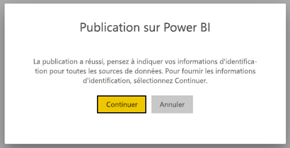
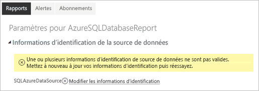
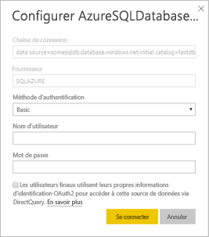

# Sources de données prises en charge pour les rapports paginés Power BI

Cet article présente les sources de données prises en charge pour les rapports paginés dans le service Power BI, et comment vous connecter à des sources de données Azure SQL Database. Certaines sources de données sont prises en charge en mode natif. Vous pouvez vous connecter à d’autres par le biais de passerelles de données.

## Sources de données prises en charge en mode natif

Les rapports paginés prennent en charge en mode natif la liste suivante de sources de données :

| Source de données | Authentification | Notes |
| --- | --- | --- |
| Azure SQL Database  Azure SQL Data Warehouse | De base, authentification unique (SSO), OAuth2 |   |
| Azure SQL Managed Instance | De base | via un point de terminaison public à l’aide de l’extension Azure SQL Database  |
| Azure Analysis Services | SSO, OAuth2 |   |
| Jeu de données Power BI | SSO | Jeux de données Power BI Premium et non-Premium |
| Jeu de données Premium Power BI (XMLA) | SSO |   |
| Entrer des données | N/A | Les données sont incorporées dans le rapport. |

À l’exception d’Azure SQL Database, toutes les sources de données sont prêtes à être utilisées après le chargement du rapport dans le service Power BI. Par défaut, les sources de données utilisent l’authentification unique, le cas échéant. Pour Azure Analysis Services, vous pouvez changer le type d’authentification et choisir OAuth2.

Pour les sources de données Azure SQL Database, vous devez fournir plus d’informations, comme décrit dans la section [Authentification Azure SQL Database](#azure-sql-database-authentication).

## Autres sources de données

En plus des sources de données prises en charge en mode natif ci-dessus, les sources de données suivantes sont accessibles par le biais d’une [passerelle de données Power BI](service-gateway-onprem.md) :

- SQL Server
- SQL Server Analysis Services
- Oracle
- Teradata

Pour les rapports paginés, Azure SQL Database et Azure Analysis Services ne sont pas accessibles actuellement par le biais d’une passerelle de données Power BI.

## Authentification Azure SQL Database

Pour les sources de données Azure SQL Database, vous devez définir un type d’authentification avant d’exécuter le rapport. Cela s’applique uniquement quand vous utilisez une source de données pour la première fois dans un espace de travail. La première fois, le message suivant s’affiche :

Si vous ne fournissez pas d’informations d’identification, une erreur se produit quand vous exécutez le rapport. Sélectionnez **Continuer** pour accéder à la page **Informations d’identification de la source de données** du rapport que vous venez de charger :

Sélectionnez le lien **Modifier les informations d’identification** pour une source de données donnée afin d’afficher la boîte de dialogue **Configurer** :

Pour les sources de données Azure SQL Database, voici les types d’authentification pris en charge :

- De base (nom d’utilisateur et mot de passe)
- Authentification unique (SSO)
- OAuth2 (jeton AAD stocké)

Pour que l’authentification unique et OAuth2 fonctionnent correctement, [la prise en charge de l’authentification AAD doit être activée](https://docs.microsoft.com/azure/sql-database/sql-database-aad-authentication-configure) sur le serveur Azure SQL Database auquel la source de données se connecte. Pour la méthode d’authentification OAuth2, AAD génère un jeton et le stocke en vue d’un accès ultérieur à la source de données. Pour utiliser la [méthode d’authentification SSO](https://docs.microsoft.com/power-bi/service-azure-sql-database-with-direct-connect#single-sign-on) à la place, sélectionnez l’option SSO située juste en dessous, **Les utilisateurs finaux utilisent leurs propres informations d’identification OAuth2 pour accéder à cette source de données via DirectQuery**.
  
## Étapes suivantes

[Afficher un rapport paginé dans le service Power BI](consumer/paginated-reports-view-power-bi-service.md)

D’autres questions ? [Posez vos questions à la communauté Power BI](https://community.powerbi.com/)
